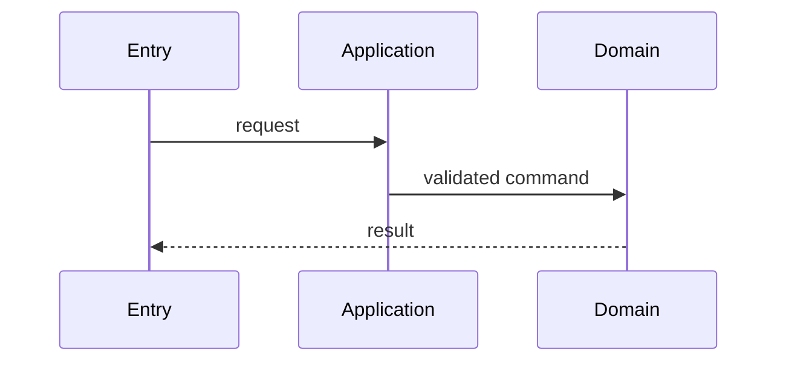

# Behavior Flow Documentation

> 本目录记录已经实现并经过验证的重要业务行为调用链，帮助后续 Review、Debug、
> Human Ownership、回归影响分析和面试讲解。

Behavior Flow 是 implementation evidence，不是提前描述未来系统的设计稿。

---

## 1. Documentation Boundary / 文档边界

项目文档职责保持分离：

| Location | Responsibility |
|---|---|
| `docs/architecture/DATA_FLOW.md` | 系统级 Logical Data Flow、数据权责与长期状态边界 |
| `docs/architecture/AGENT_FLOW.md` | 通用 Agent / LLM / Tool / Java Runtime 边界 |
| `docs/features/` | Feature 目标、范围、设计决定与阶段状态 |
| `docs/flow/` | 已实现具体行为的真实调用顺序、状态变化和失败路径 |

Flow 不替代 Architecture、ADR、Feature Dossier 或测试。

## 2. Gate Position / 流程位置

重要完整行为按以下顺序收口：

```text
行为代码链完成
→ Targeted / Integration Verification
→ 创建或更新 Behavior Flow
→ 根据真实代码与测试校验 Flow
→ REVIEW_PENDING
→ Diff Review
→ Ownership Check
→ READY_TO_COMMIT
```

Flow 应成为 Review 和 Ownership 的输入，而不是在所有 Review 完成后补写的装饰性文档。

## 3. Trigger / 触发条件

满足以下任一条件，且已形成可运行、可验证的完整行为时，默认创建或更新 Flow：

- 跨 Controller / Application / Domain / Repository / Infrastructure；
- 存在 authentication、authorization、resource ownership 或 language isolation；
- 存在 transaction、concurrency、timeout、retry、idempotency 或 failure recovery；
- 读取或修改重要业务状态、长期学习状态或 Persistent Learner Model；
- 涉及 Planner、Evaluator、Learning Memory、Model Gateway、Tool Gateway 或 Agent workflow；
- 仅阅读单个 class 无法安全理解入口、核心判断、状态变化和结果；
- 当前行为需要 A 类 Human Ownership evidence。

以下内容默认不单独创建 Flow：

- 简单 CRUD；
- DTO、Mapper、getter / setter；
- 无关键判断和状态变化的机械调用链；
- 仅有 Interface、contract 或尚未接通的未来行为。

是否创建 Flow 取决于它能否明显降低理解和 Review 成本，而不是文件数量或形式完整性。

## 4. Status Model / 状态模型

### 4.1 Document Status / 文档内容状态

每份已创建的 Flow 必须在 Metadata 中声明 `Document Status`：

| Document Status | Meaning |
|---|---|
| `IMPLEMENTED` | 调用链已由真实 source code 和 verification evidence 确认 |
| `PARTIAL` | 只有部分调用链已实现，必须明确已实现与未实现边界 |
| `PROPOSED` | 仅为批准后的未来方案，不得描述成当前行为 |

本目录默认只新增 `IMPLEMENTED` Flow。确需保留 `PARTIAL` 或 `PROPOSED` 时，应与
`IMPLEMENTED` 图分开，并优先考虑是否更适合放入 `docs/features/`。

### 4.2 Review Sync Status / Review 同步状态

`Review Sync Status` 是 Review 时对 Behavior Flow 完整性和时效性的判断，不写入 Flow Metadata：

| Review Sync Status | Meaning |
|---|---|
| `NOT_REQUIRED` | 当前行为未命中 Trigger，不需要 Flow |
| `CURRENT` | Flow 存在，并与当前 source code 和 verification evidence 一致 |
| `MISSING` | 当前行为命中 Trigger，但尚未创建 Flow |
| `UPDATE_REQUIRED` | Flow 已存在，但当前修改使调用链、状态或边界描述过期 |

两个状态维度不得混用：`Document Status` 描述文档画的是什么，`Review Sync Status` 判断该文档
对于当前 Review 是否存在且仍然准确。

## 5. Required Content / 必要内容

每份 Flow 至少包含：

1. **Metadata**：Document Status、Feature / Slice、Last Verified、入口；
2. **Behavior Boundary**：触发条件、输入、成功结果以及明确不负责的行为；
3. **Main Call Chain**：从入口到结果的关键调用顺序；
4. **State and Authority**：读取什么状态、谁能修改、谁负责校验和持久化；
5. **Failure / Rejection Path**：关键拒绝、失败、fallback 或不落状态路径；
6. **Verification Evidence**：对应测试类、测试方法或实际运行证据；
7. **Source References**：关键 source path、class 和 method。

对于 DailyLanguage 核心学习链路，还必须明确：

- `languageProfileId` 的归属与 multi-language isolation；
- LLM 只产生 candidate / diagnosis / evidence，Java 是否仍持有 validation、qualification、
  state transition 和 persistence authority；
- Evaluation 或 model failure 是否会污染 Persistent Learning State；
- Credential、private context 和 trace 是否跨越了不允许的边界。

## 6. Mermaid Selection / 图类型

- `sequenceDiagram`：描述入口、关键组件和调用顺序；
- `stateDiagram-v2`：描述重要状态变化、合法迁移和失败后的状态；
- `flowchart`：只用于复杂业务分支、资格判断或恢复路径。

一份 Flow 通常以 `sequenceDiagram` 为主；存在真实状态机或长期状态变化时再增加
`stateDiagram-v2`。不要为了形式完整强制生成三种图。

图应详细到：

- API、event、job 或 application entry；
- 关键 class / component 和有业务含义的 method；
- permission、qualification 和核心 decision；
- transaction、state mutation、external boundary；
- 重要成功、拒绝和失败分支；
- 最终 response、event 或持久化结果。

图中不需要加入普通 DTO mapping、getter / setter、无业务意义的 framework boilerplate，
也不要展开每个 Spring proxy。单图过大而难以 Review 时，应按业务阶段拆分。

## 7. File Convention / 文件约定

- 目录：`docs/flow/`；
- 文件名：使用稳定、业务含义明确的 kebab-case，例如 `user-login.md`；
- 一个文件描述一个可独立触发和验证的完整行为；
- 文件标题使用项目既有 Domain Language，不为展示效果重命名架构概念；
- `Last Verified` 记录最近一次根据真实 source code 和 tests 校验的日期；
- Source References 使用 repository-relative path，必要时补充 class / method。

推荐骨架：

````markdown
# <Behavior Name> Flow

- Document Status: `IMPLEMENTED`
- Feature / Slice: `<feature-or-slice>`
- Last Verified: `YYYY-MM-DD`
- Entry: `<API / event / job / method>`

## 1. Behavior Boundary

## 2. Main Call Chain



## 3. State and Authority

## 4. State Transition

## 5. Failure / Rejection Paths

## 6. Verification Evidence

## 7. Source References
````

## 8. Maintenance Rule / 维护规则

修改以下任一内容时，必须检查对应 Flow 是否需要同步：

- behavior entry；
- core decision 或 qualification rule；
- state read / mutation；
- authentication、authorization、ownership 或 isolation boundary；
- transaction、timeout、retry、idempotency 或 failure semantics；
- external provider、Tool 或 persistence boundary；
- 影响调用链结论的关键测试。

Flow 与真实代码冲突时，以当前 source code 和 test evidence 为事实依据，并把文档标记为
需要更新；不得为了匹配文档而静默改变代码 Architecture。

对于满足本规则 Trigger 的行为，`Review Sync Status` 为 `MISSING` 或 `UPDATE_REQUIRED` 时不得完成
Ownership 收口或进入 `READY_TO_COMMIT`。这属于 Documentation / Ownership Gate，除非错误文档
掩盖了真实 Correctness、Security、Data 或 Architecture 风险，否则不自动把 Code Review 标记为
`BLOCK`。

## 9. Flow Index / 索引

新增 Flow 时在下表登记：

| Behavior | Document Status | Feature / Slice | Document |
|---|---|---|---|
| Text Generation Credential Propagation | IMPLEMENTED | M0-S7A / M0-S8C / M0-S8D | [`text-generation-credential-propagation.md`](text-generation-credential-propagation.md) |
| OpenAI-compatible Text Provider Call | IMPLEMENTED | M0-S7B / M0-S7C / M0-S8A / M0-S8D | [`text-generation-openai-compatible-provider.md`](text-generation-openai-compatible-provider.md) |
| Model Provider Connection Verification | IMPLEMENTED | M0-S7D / M0-S8C | [`model-provider-connection-verification.md`](model-provider-connection-verification.md) |
| Text Generation Job Start | IMPLEMENTED | M0-S9K1 / M0-S9K2 / M0-S9K3 | [`text-generation-job-start.md`](text-generation-job-start.md) |
