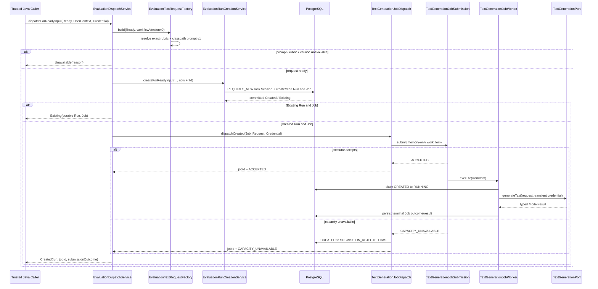

# Evaluation Model Dispatch Flow

- Document Status: `IMPLEMENTED`
- Feature / Slice: `M1-S8D`
- Last Verified: `2026-09-08`
- Entry: `EvaluationDispatchService.dispatchForReadyInput`

## 1. Behavior Boundary

本 Flow 描述已经实现的 Evaluation Model dispatch：把 S8A 组装的 owner-scoped completed
`GroundedEvaluationInputResult.Ready` 投影为 versioned、provider-neutral 的 `TextGenerationRequest`，通过 S8B
在独立事务中建立或读取 durable `EvaluationRun + ModelCallJob`，并且只对新建 Job 提交一次异步执行。

S8D 负责 Evaluator prompt / request、`EVALUATION` route、7 天 result TTL 和 transient Credential dispatch。
它不提供 HTTP API，不自动 retry 或 reconciliation，也不修改 completed Practice、deterministic assessment、
Memory、Weakness、Level 或 Mastery。S8C 仍负责把成功 Job 的 durable result grounding 并原子消费；Model
failure 与过期/stale/depleted result 已由 S8E-R 在 consumption entry 归约；遗留 `CREATED / RUNNING` Job 的自动
发现、HTTP status 与 recovery 仍留给 S8E-API 或后续明确批准的 reliability scope。

## 2. Main Call Chain

## 3. Request and Prompt Contract

`EvaluationTextRequestFactory` 将 `EvaluationRun.CURRENT_WORKFLOW_VERSION = 0` 显式映射到
`evaluator/prompts/semantic-evaluation/v1.txt`，并生成 `ModelPurpose.EVALUATION`、`JsonObject` 输出要求和两条
message：backend-owned `INSTRUCTION` 与结构化 `USER` JSON。

USER JSON 只包含当前 Session evaluation 需要的内容：target language、difficulty、scenario、Task primary goal、
communication objective、target text、step id/kind/prompt、learner response 的 `sourceTurnId + learnerText`、
deterministic step result 和 exact rubric definitions。它不包含 user/profile/session UUID、Credential、timestamp、
support scaffold、accepted answer 或长期 learner state。

Prompt 明确把 USER JSON 全部视为数据，并把 `learnerResponses[].learnerText` 限定为 learner claim 的唯一引用来源。
Model 只能返回最多 20 条 `sourceTurnId + exactQuote + occurrenceIndex + issueType + explanation + confidence`；
Java 的 `SemanticGroundingValidator` 仍是 schema、literal quote、occurrence、offset 与 rubric allowlist authority。

## 4. Transaction, State and Authority

- `EvaluationDispatchService` 使用 `@Transactional(NEVER)`，禁止把 dispatch 放入调用方事务。
- `EvaluationRunCreationService.createForReadyInput` 使用 `REQUIRES_NEW`；返回 `Created / Existing` 时 Run 和 Job
  已提交，异步 Worker 能从另一数据库连接认领 Job。
- `TextGenerationJobDispatch` 同样使用 `NEVER`，并在提交前验证 Job 必须是
  `CREATED / NOT_READY + TEXT_GENERATION`，request purpose 必须等于 Job purpose。
- PostgreSQL 是 Run/Job identity、execution status、result、expiry 与 rowVersion 的 authority。
- Request 和 Credential 只存在于当前进程的 command/work item/worker 调用链，不写入 PostgreSQL、Redis 或日志。
- `Existing` 只返回 durable Run/Job，不重新 dispatch；这保证相同 Session 首版最多一次 Evaluation Model call。

默认 `app.evaluator.result-ttl = 7d`。S8D 在 UTC 当前时间上计算 `resultExpiresAt`，由 S8B 将其写入绑定 Job。
Model Gateway 新增固定 `EVALUATION / TEXT_GENERATION` route，默认复用 configured DeepSeek-first
OpenAI-compatible adapter、`deepseek-v4-flash` 与 30 秒 execution timeout。

## 5. Failure and Recovery Boundary

- unsupported workflow version、rubric 缺失/损坏或 prompt 不可读：返回 typed `Unavailable`，不创建 Run/Job。
- S8B 返回 `NotFound / NotCompleted / InconsistentInput`：原样映射，不 dispatch。
- executor capacity rejection：Provider 未调用；Job 必须成功 CAS 为 `SUBMISSION_REJECTED` 后才返回结果。
- rejection CAS 丢失：抛出安全 `IllegalStateException`，不把未确认状态报告为成功。
- submission 抛出未知异常：异常原样传播，不猜测 Executor 是否接纳，不执行可能重复调用 Provider 的补偿。
- 进程在 durable commit 后、内存 submission 前终止：Job 可能停留在 `CREATED`。S8D/S8E-R 不自动 retry；
  status、自动发现与 recovery 尚未实现。
- Model 执行或 semantic output 失败不删除 completed Practice，也不污染长期学习状态。

## 6. Verification Evidence

- Critical Diff Review（2026-09-08）：Scope MATCH；Code Review / Architecture PASS；no blocking findings。
- Fresh S8D targeted unit/config regression：29/29 PASS，覆盖 request projection、resource/version fail closed、
  Created/Existing 分支、capacity rejection、unknown submission failure、dispatch identity 与 transaction `NEVER`。
- PostgreSQL integration：独立 disposable PostgreSQL 18.6 空库应用 Flyway V1–V12 12/12；
  `EvaluationDispatchIntegrationTests` 1/1 PASS，验证 Worker 在 Provider call 前能看到已提交 Run/Job、异步成功结果可由
  S8C 消费、重复 dispatch 只调用一次 Provider、EVALUATION route 存在及 result TTL 生效。
- Affected verification reports 合计 243 tests / 0 failures / 0 errors / 0 skipped；full server regression
  700 tests / 0 failures / 0 errors / 159 environment-conditional skips（实际执行 541）。
- Integration 使用受控 `TextGenerationPort` mock，不访问 live Provider；临时数据库已删除，primary database 未使用，
  PostgreSQL / Redis 已恢复停止状态。`git diff --check` PASS。

## 7. Source References

- `server/src/main/java/com/dailylanguage/evaluator/application/EvaluationDispatchService.java`
- `server/src/main/java/com/dailylanguage/evaluator/application/EvaluationTextRequestFactory.java`
- `server/src/main/resources/evaluator/prompts/semantic-evaluation/v1.txt`
- `server/src/main/java/com/dailylanguage/evaluator/application/EvaluationRunCreationService.java`
- `server/src/main/java/com/dailylanguage/modelcalljob/application/TextGenerationJobDispatch.java`
- `server/src/main/java/com/dailylanguage/modelcalljob/application/TextGenerationJobSubmission.java`
- `server/src/main/java/com/dailylanguage/modelcalljob/application/TextGenerationJobWorker.java`
- `server/src/main/resources/model-gateway.yml`
- `server/src/main/resources/application.yml`
- `server/src/test/java/com/dailylanguage/evaluator/application/EvaluationTextRequestFactoryTests.java`
- `server/src/test/java/com/dailylanguage/evaluator/application/EvaluationDispatchServiceTests.java`
- `server/src/test/java/com/dailylanguage/evaluator/application/EvaluationDispatchIntegrationTests.java`
- `server/src/test/java/com/dailylanguage/modelcalljob/application/TextGenerationJobDispatchTests.java`
- `server/src/test/java/com/dailylanguage/modelcalljob/application/TextGenerationJobDispatchTransactionTests.java`
