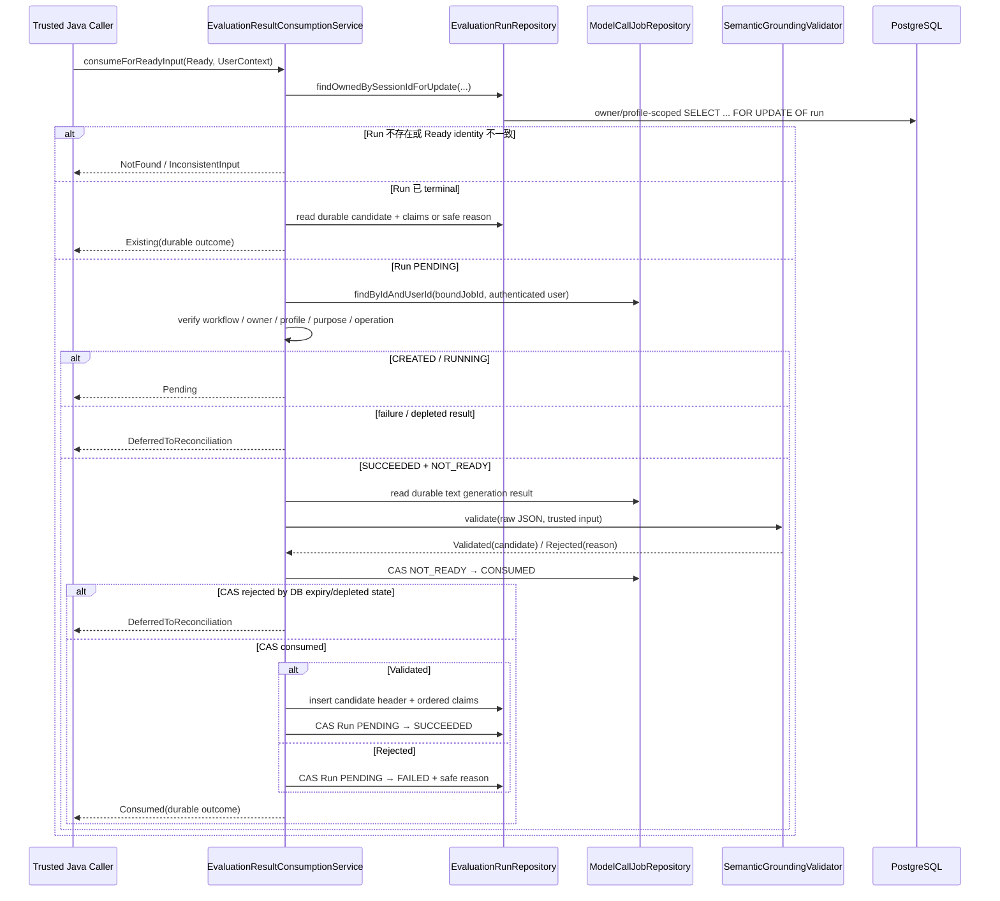

# Evaluation Result Consumption Flow

- Document Status: `IMPLEMENTED`
- Feature / Slice: `M1-S8C`
- Last Verified: `2026-09-07`
- Entry: `EvaluationResultConsumptionService.consumeForReadyInput`

## 1. Behavior Boundary

本 Flow 描述已经实现的 Evaluation result consumption：把 S8A 组装的 owner-scoped completed
`GroundedEvaluationInputResult.Ready`、S8B 建立的 `EvaluationRun + ModelCallJob`，以及该 Job 已 durable
保存的 `SUCCEEDED` text result，在一个 read-write transaction 内转换成 terminal Evaluation outcome。

成功 grounding 时保存唯一 `ValidatedSemanticCandidate` header 与有序 claims，并把 Run 标记为
`SUCCEEDED`；grounding 拒绝时只保存安全的 `RejectionReason`，把 Run 标记为 `FAILED`。两条路径都与
Job `NOT_READY → CONSUMED` 原子提交。terminal Run 的重复调用只读取 durable outcome，不重新 grounding。

本 Flow 不负责 Model request / prompt 构造、route、Credential、submission 或 dispatch（M1-S8D），也不负责
Model failure、expired / stale result 的最终 reconciliation 或 HTTP API（M1-S8E）。它不创建长期 Evidence，
不修改 Memory、Weakness、Level 或 Mastery；validated candidate 仍是 Session-level diagnosis candidate。

## 2. Main Call Chain



## 3. State and Authority

- **Caller identity**：只取 `UserContext.userId`；Ready 中的 userId 只做一致性比较，不提供授权。
- **Ownership / language isolation**：Run lock、candidate insert、claim insert、terminal read 与 finalize 都通过
  `run / candidate → session → learning_task` 重校验 trusted owner 与 exact `languageProfileId`；owned Run/candidate
  gate 在需要核对 target language 时继续关联 `language_profile`。
- **Model result authority**：只读取 Run 绑定 Job 的 PostgreSQL result row；不接受调用方提供 raw JSON 或 jobId。
- **Semantic authority**：不可信 Model JSON 只能由 `SemanticGroundingValidator` 转为 `Validated / Rejected`；
  quote occurrence、UTF-16 offsets、rubric issue allowlist 与 trusted snapshot consistency 由 Java 裁决。
- **Persistence authority**：PostgreSQL CAS 与 constraints 决定 Job consumption、Run terminal lifecycle、candidate
  provenance 和 claim/source-response FK；应用层不能用返回对象代替 durable state。
- **Privacy boundary**：candidate 保存 grounding 所需的 exact learner quote 与 Model explanation；安全 rejection 只保存
  category。Credential、完整 Prompt、完整 Model raw output 与 provider request 不写入 candidate/Run，也不写日志。

## 4. State Transition and Persistence

Flyway V12 把 `evaluation_run` 生命周期扩展为：

```text
PENDING
  ├─ Validated → SUCCEEDED + completed_at + one candidate header + 0..20 claims
  └─ Rejected  → FAILED    + completed_at + grounding_rejection_reason
```

消费成功时同一 transaction 内固定执行：

```text
ModelCallJob: SUCCEEDED / NOT_READY
    → CAS SUCCEEDED / CONSUMED
    → candidate + claims（Validated）或 safe rejection（Rejected）
    → EvaluationRun PENDING / rowVersion=N
       CAS → SUCCEEDED|FAILED / rowVersion=N+1
```

任一步抛出异常，Spring transaction 回滚全部写入，Job 恢复为 `NOT_READY`，Run 保持 `PENDING`，candidate/claims
不留下部分数据。`validated_semantic_candidate` 的 composite FK 保证 header 的 Session 等于 Run Session；
`validated_semantic_claim` 通过 `(session_id, source_turn_id)` 引用该 Session 已接受的 `practice_response`。

Run 行锁是相同 Evaluation consumer 的串行化点：首个调用提交 terminal outcome 后，后到调用读取同一 durable
outcome 并返回 `Existing`。其他通用 Job consumer 不受 Run 锁控制，因此 Job consumption 仍使用 `rowVersion`、
workflow version、状态与 PostgreSQL `CURRENT_TIMESTAMP` expiry gate 的 CAS。

## 5. Failure / Rejection Paths

- `NotFound`：owner/profile 范围内不存在 Ready Session 对应的 Run。
- `InconsistentInput`：Ready caller、Run、Session 或 Task identity 不一致；不读取绑定 Job。
- `Pending`：绑定 Job 仍为 `CREATED / RUNNING`。
- `DeferredToReconciliation`：Model execution failure、`PENDING_CONFIRMATION / EXPIRED / STALE / DISCARDED`，或
  PostgreSQL 判定 `NOT_READY` result 已过期；S8C 不替 S8E 执行 reconciliation。
- `Rejected(reason)`：Model execution 已成功且 result 被消费，但 semantic output 未通过 grounding；Run durable
  终结为 `FAILED`，不保存 raw output 或部分 candidate。
- `IllegalStateException`：绑定 Job 缺失/identity 漂移、成功 Job 缺 result、Job 已 `CONSUMED` 但 Run 仍
  `PENDING`、terminal Run 缺少 durable outcome，或无法解释的 CAS/finalize 冲突。这些属于持久化不变量损坏，
  fail closed 并回滚本次 transaction。
- Model failure 或 invalid output 不删除、回滚或覆盖 completed Practice 与 `DeterministicAssessment`，也不污染长期状态。

## 6. Verification Evidence

- S8C unit（2026-09-07）：`EvaluationResultConsumptionServiceTests` 19/19 PASS；affected unit regression
  `EvaluationRunCreationServiceTests` 14/14、`GroundedEvaluationInputReaderTests` 18/18、
  `SemanticGroundingValidatorTests` 33/33、`ClasspathRubricSourceTests` 22/22，合计 106/106 PASS。
- S8C integration：`EvaluationResultConsumptionIntegrationTests` 12/12 PASS，覆盖 validated / zero-claim /
  rejected outcome、terminal replay、并发单次消费、pending/deferred、owner/profile isolation、candidate-before-consume
  DB gate、claim failure transaction rollback 与 durable invariant corruption。
- Fresh external verification：独立 disposable PostgreSQL 18.6 空库从 Flyway V1–V12 12/12 应用；S8C 12/12、
  S8B 8/8、S8A Reader 5/5、S7 grounding 3/3、ModelCallJob consumption 6/6、ModelCallJob text success 9/9，
  affected integration regression 合计 43/43 PASS（0 failures / 0 errors / 0 skipped）。两个临时数据库均已删除，
  primary database 未作为测试目标，未执行 Flyway repair 或 checksum 修改。
- Production / test compilation PASS；Mapper XML parse PASS；`git diff --check` 与 untracked whitespace check PASS。
- Critical Diff Review：Scope MATCH（超出初始 LOC guardrail 已由用户明确接受）；Code Review / Architecture PASS，
  no blocking findings。未重跑 repository full server suite。

## 7. Source References

- `server/src/main/java/com/dailylanguage/evaluator/application/EvaluationResultConsumptionService.java`
- `server/src/main/java/com/dailylanguage/evaluator/application/SemanticGroundingValidator.java`
- `server/src/main/java/com/dailylanguage/evaluator/domain/EvaluationRun.java`
- `server/src/main/java/com/dailylanguage/evaluator/domain/SemanticGroundingResult.java`
- `server/src/main/java/com/dailylanguage/evaluator/infrastructure/EvaluationRunRepository.java`
- `server/src/main/java/com/dailylanguage/evaluator/infrastructure/EvaluationRunMapper.java`
- `server/src/main/resources/mapper/EvaluationRunMapper.xml`
- `server/src/main/resources/db/migration/V12__add_evaluation_run_outcome.sql`
- `server/src/main/java/com/dailylanguage/modelcalljob/infrastructure/ModelCallJobRepository.java`
- `server/src/main/resources/mapper/ModelCallJobMapper.xml`
- `server/src/test/java/com/dailylanguage/evaluator/application/EvaluationResultConsumptionServiceTests.java`
- `server/src/test/java/com/dailylanguage/evaluator/application/EvaluationResultConsumptionIntegrationTests.java`
