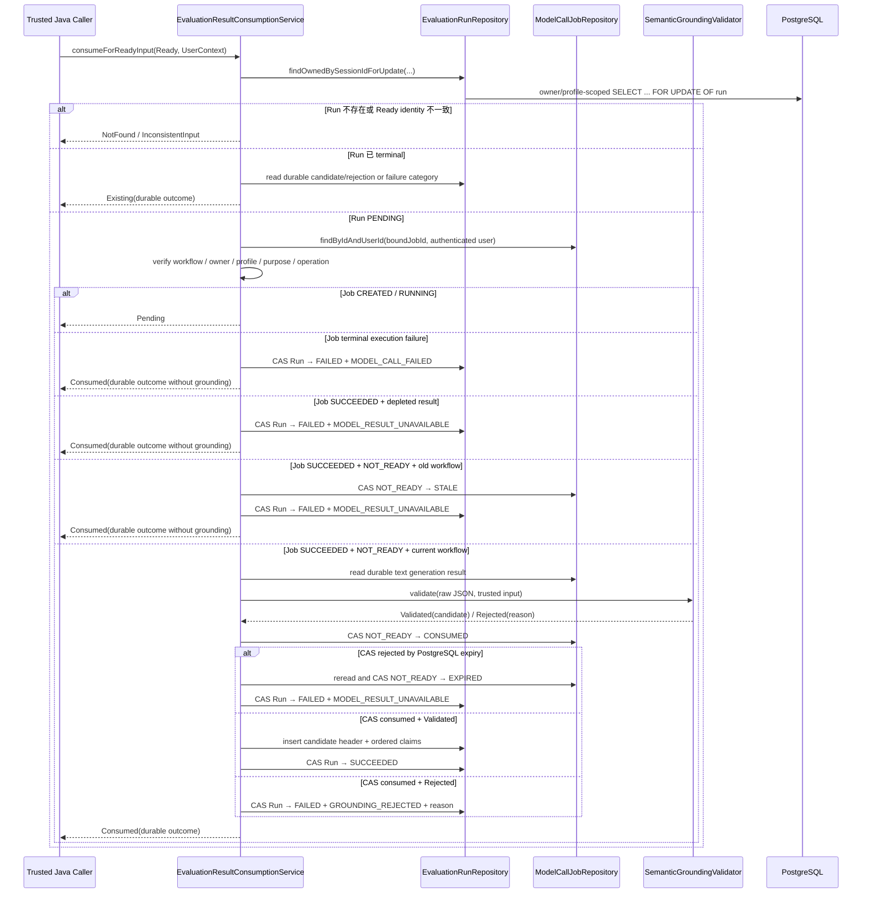

# Evaluation Result Consumption and Reconciliation Flow

- Document Status: `IMPLEMENTED`
- Feature / Slice: `M1-S8C / M1-S8E-R`
- Last Verified: `2026-09-08`
- Entry: `EvaluationResultConsumptionService.consumeForReadyInput`

## 1. Behavior Boundary

本 Flow 描述已经实现的 Evaluation result consumption 与 workflow-owned reconciliation kernel：把 S8A 组装的
owner-scoped completed `GroundedEvaluationInputResult.Ready`、S8B 建立的 `EvaluationRun + ModelCallJob`，以及
Job 的 durable execution/result 状态，在一个 read-write transaction 内转换成 terminal Evaluation outcome。

current workflow 的 `SUCCEEDED / NOT_READY` result 继续由 S8C 执行 Java grounding：成功时保存唯一
`ValidatedSemanticCandidate` header 与有序 claims，并把 Run 标记为 `SUCCEEDED`；grounding 拒绝时保存安全
`RejectionReason`，把 Run 标记为 `FAILED + GROUNDING_REJECTED`。两条路径都与 Job
`NOT_READY → CONSUMED` 原子提交。

S8E-R 归约 terminal Model execution failure、expired、stale 或其他不可再消费 result，只把 Run 的 semantic branch
终结为 `FAILED`，不修改 completed Practice、`DeterministicAssessment` 或长期 learner state。`CREATED / RUNNING`
仍返回 `Pending`，不猜测 outcome、不自动 retry。terminal Run 重复调用只读取 durable outcome，不重新 grounding。

本 Flow 不负责 Model request / prompt 构造、route、Credential、submission 或 dispatch（M1-S8D，见
`evaluation-model-dispatch.md`），也不提供 HTTP API、background scheduler、automatic retry 或遗留
`CREATED / RUNNING` recovery。它不创建长期 Evidence，不修改 Memory、Weakness、Level 或 Mastery。

## 2. Main Call Chain



## 3. State and Authority

- **Caller identity**：只取 `UserContext.userId`；Ready 中的 userId 只做一致性比较，不提供授权。
- **Ownership / language isolation**：Run lock、candidate insert、claim insert、terminal read 与 finalize 都通过
  `run / candidate → session → learning_task` 重校验 trusted owner 与 exact `languageProfileId`；Job 同时绑定
  owner/profile、purpose、operation、workflow id/step/version。
- **Model result authority**：只读取 Run 绑定 Job 的 PostgreSQL result row；不接受调用方提供 raw JSON 或 jobId。
- **Semantic authority**：不可信 Model JSON 只能由 `SemanticGroundingValidator` 转为 `Validated / Rejected`；
  quote occurrence、UTF-16 offsets、rubric allowlist 与 trusted snapshot consistency 由 Java 裁决。
- **Failure authority**：Job 保存具体 execution/consumption status；`EvaluationRun.failureReason` 只保存稳定的
  workflow-level category。Java domain invariant 与 PostgreSQL V13 constraints 使用同一 closed pairing。
- **Time / persistence authority**：PostgreSQL `CURRENT_TIMESTAMP`、rowVersion CAS、FK 和 check constraints 决定
  expiry、Job consumption 与 Run terminal lifecycle；JVM 时间或返回对象不能替代 durable state。
- **Privacy boundary**：candidate 保存 grounding 所需的 exact learner quote 与 Model explanation；Run failure 只保存
  safe category。Credential、完整 Prompt、完整 Model raw output 与 provider request 不写入 Run，也不写安全日志。

## 4. State Transition and Persistence

Flyway V13 在 V12 outcome 上增加 `failure_reason`：

```text
EvaluationRun PENDING
  ├─ Validated current result
  │    └─ SUCCEEDED + completed_at + candidate header + 0..20 claims
  ├─ Grounding rejected
  │    └─ FAILED + GROUNDING_REJECTED + grounding_rejection_reason
  ├─ Model execution terminal failure
  │    └─ FAILED + MODEL_CALL_FAILED
  └─ Result expired / stale / depleted
       └─ FAILED + MODEL_RESULT_UNAVAILABLE
```

`GROUNDING_REJECTED` 必须带 safe `grounding_rejection_reason`；`MODEL_CALL_FAILED` 与
`MODEL_RESULT_UNAVAILABLE` 必须不带 grounding reason。V13 将已有 V12 `FAILED` Run 回填为
`GROUNDING_REJECTED`，保留原 rejection reason，并建立 `(created_at, id) WHERE status='PENDING'` partial index。

所有 Run outcome 都在同一 Spring transaction 内完成。normal grounding path 的 Job `CONSUMED`、candidate/claims 或
safe rejection 与 Run terminal transition 同时提交；old/expired path 的 Job `STALE / EXPIRED` 与 Run failure 同时
提交；已经 terminal 的 Model execution state 是本 transaction 只读的 durable 前置事实。任一步异常会回滚本
transaction 的全部 mutation。

Run 行锁串行化同一 Evaluation consumer。通用 Job consumer 不受 Run lock 控制，因此 Job mutation 继续使用
execution status、consumption status、workflow version、rowVersion 与 database time CAS。CAS 失败后必须重读 durable
Job；identity 漂移、无合法 state transition 或 `CONSUMED + PENDING Run` 均 fail closed。

## 5. Failure / Rejection Paths

- `NotFound`：owner/profile 范围内不存在 Ready Session 对应的 Run。
- `InconsistentInput`：Ready caller、Run、Session 或 Task identity 不一致；不读取绑定 Job。
- `Pending`：绑定 Job 仍为 `CREATED / RUNNING`；当前 kernel 不自动恢复或 retry。
- `GROUNDING_REJECTED`：Model execution 成功且 result 已消费，但 semantic output 未通过 Java grounding；只保存安全
  reason，不保存 raw output 或部分 candidate。
- `MODEL_CALL_FAILED`：Job 为 `FAILED / TIMED_OUT / OUTCOME_UNKNOWN / SUBMISSION_REJECTED`；具体状态留在 Job。
- `MODEL_RESULT_UNAVAILABLE`：Job result 为 `PENDING_CONFIRMATION / EXPIRED / STALE / DISCARDED`，或 old/current
  result 经 CAS 被裁决为 stale/expired。
- `IllegalStateException`：绑定 Job 缺失/identity 漂移、成功 Job 缺 result、Job 已 `CONSUMED` 但 Run 仍
  `PENDING`、terminal Run 缺 durable outcome，或无法解释的 CAS/finalize 冲突；fail closed 并回滚。
- 任一 Model/grounding failure 都不删除、回滚或覆盖 completed Practice 与 `DeterministicAssessment`，也不污染长期状态。

## 6. Verification Evidence

- S8C baseline（2026-09-07）：service 19/19、affected unit 106/106；PostgreSQL 18.6 empty schema Flyway
  V1–V12 12/12，result consumption 12/12、affected integration 43/43 PASS。
- S8E-R local（2026-09-08）：final targeted 35/35 PASS；implementation-stage full server 703 tests / 0 failures / 0 errors /
  160 environment-conditional skips（实际执行 543）；Mapper SQL safety 2/2；`git diff --check` PASS。
- S8E-R external（2026-09-08）：disposable PostgreSQL 18.6 empty schema Flyway V1–V13 13/13；Evaluation result
  consumption、Run creation、dispatch、ModelCallJob consumption integration 合计 28/28 PASS，0 failures / 0 errors /
  0 skipped。
- Upgrade verification：独立数据库先迁移到 V12 并建立历史 grounding `FAILED` Run，再升级 V13；V12 与 V13
  probe 各 10/10 PASS，历史行得到 `GROUNDING_REJECTED` 且保留 `QUOTE_MISMATCH`。V13 constraints 与 partial index
  已通过 PostgreSQL catalog 查询确认。
- 临时容器/数据库均已删除，primary database 未作为测试目标；既有 PostgreSQL / Redis 保持 healthy。未执行
  Flyway repair、checksum 修改或 live Provider call。
- Critical Diff Review：Scope MATCH；Code Review / Architecture PASS；no blocking findings。

## 7. Source References

- `server/src/main/java/com/dailylanguage/evaluator/application/EvaluationResultConsumptionService.java`
- `server/src/main/java/com/dailylanguage/evaluator/application/SemanticGroundingValidator.java`
- `server/src/main/java/com/dailylanguage/evaluator/domain/EvaluationRun.java`
- `server/src/main/java/com/dailylanguage/evaluator/domain/SemanticGroundingResult.java`
- `server/src/main/java/com/dailylanguage/evaluator/infrastructure/EvaluationRunRepository.java`
- `server/src/main/java/com/dailylanguage/evaluator/infrastructure/EvaluationRunMapper.java`
- `server/src/main/resources/mapper/EvaluationRunMapper.xml`
- `server/src/main/resources/db/migration/V12__add_evaluation_run_outcome.sql`
- `server/src/main/resources/db/migration/V13__add_evaluation_run_failure_reason.sql`
- `server/src/main/java/com/dailylanguage/modelcalljob/infrastructure/ModelCallJobRepository.java`
- `server/src/main/resources/mapper/ModelCallJobMapper.xml`
- `server/src/test/java/com/dailylanguage/evaluator/application/EvaluationResultConsumptionServiceTests.java`
- `server/src/test/java/com/dailylanguage/evaluator/application/EvaluationResultConsumptionIntegrationTests.java`
- `server/src/test/java/com/dailylanguage/modelcalljob/infrastructure/ModelCallJobConsumptionRepositoryIntegrationTests.java`
