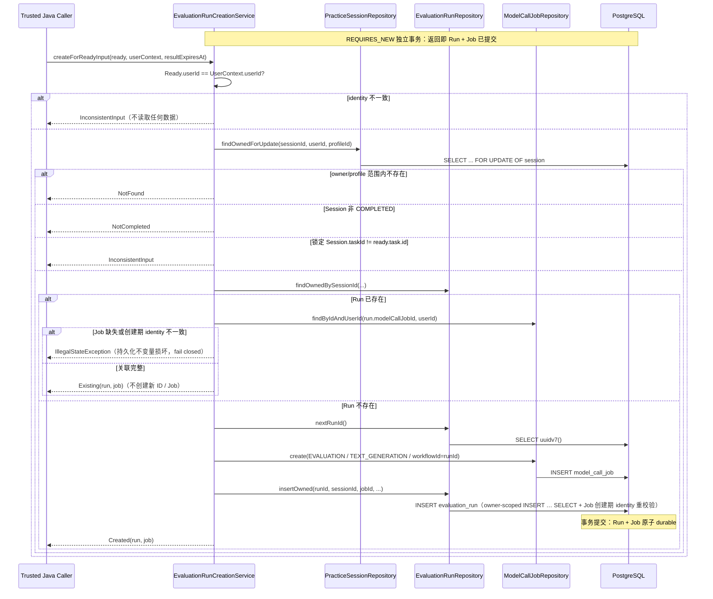

# EvaluationRun Creation Flow

- Document Status: `IMPLEMENTED`
- Feature / Slice: `M1-S8B`
- Last Verified: `2026-09-07`
- Entry: `EvaluationRunCreationService.createForReadyInput`

## 1. Behavior Boundary

本 Flow 描述已实现的 EvaluationRun 创建入口：在**任何 Model dispatch 之前**，把 S8A 产出的
`GroundedEvaluationInputResult.Ready` 转换为一个已 durable 提交的 `EvaluationRun` 及其唯一
`ModelCallJob`。方法成功返回时两者必然同时存在于数据库；重复或并发请求返回同一关联，不创建第二次
Evaluation。

本 Flow 不负责：Model dispatch / queue submission（不调用 `TextGenerationJobStart` 或任何 submission
boundary）、Prompt / Rubric / request 构造、BYOK Credential 接收或传递、Provider route 选择、结果消费、
Semantic grounding、Evaluation candidate 持久化、EvaluationRun 完成状态（S8C）、HTTP API。不持久化
Prompt、Rubric 内容、Model request、Credential 或 evaluation 结果。

## 2. Main Call Chain



## 3. State and Authority

- **identity authority**：`userId` 只信任 authenticated `UserContext`；`Ready` 是可构造的 Java 对象，
  不是 authorization proof，一致性在读取任何数据前裁决。
- **ownership**：`evaluation_run` 不保存 `user_id` / `language_profile_id`，归属经
  `EvaluationRun → PracticeSession → LearningTask → userId + languageProfileId` 还原；行锁读取与
  `INSERT … SELECT` 在数据库内两次重校验。`model_call_job` 的 composite FK
  `(language_profile_id, user_id)` 另行裁决 Profile-owner 关系。
- **并发 / 幂等 authority**：`findOwnedForUpdate` 的 `SELECT ... FOR UPDATE OF session` 是唯一串行化点；
  `UNIQUE (session_id)` 与 `UNIQUE (model_call_job_id)` 是并发下的第二层最终约束。后到者获得锁后
  查询到既有 Run 并返回 `Existing`；本 slice 不把重复解释为 retry。
- **workflow identity**：`workflowVersion = 0`（S8 第一版）、`workflowStepId = SEMANTIC_EVALUATION`，
  Run 与绑定 Job 必须一致持有；`model_call_job.workflow_id` 精确等于 `EvaluationRun.id`（Run id 先于
  Job 创建经 `SELECT uuidv7()` 取得）。既有 Run 的关联 Job 缺失或创建期 identity（workflowId /
  stepId / version / purpose / operation / owner / profile）不一致时是**持久化不变量损坏**：以不携带
  ids / 敏感内容的 `IllegalStateException` fail closed，不创建替代 Job，也不静默修复——避免上层把
  系统数据损坏当作普通输入拒绝。数据库 insert gate 同样 JOIN `model_call_job` 核对完整创建期
  identity（owner/profile、EVALUATION / TEXT_GENERATION、workflowId=runId、stepId、version），
  Java 校验与数据库 authority 双层一致。
- **事务**：`@Transactional(propagation = REQUIRES_NEW)`——Run 与 Job 在同一独立事务内提交；即使调用方
  意外存在外层事务，dispatch（S8D）也不可能发生在 Run/Job 未提交的窗口内。任一步失败整体回滚，
  不留下 orphan Job。

## 4. State Transition

S8B 生命周期封闭为单状态（`V11` CHECK）：

```text
EvaluationRun: PENDING（created）；completed_at 必须为 NULL
ModelCallJob:  CREATED（execution）/ NOT_READY（consumption）
```

S8C 实现完成状态时再扩展 `status` / `completed_at` 约束；S8B 不预先声明尚未实现的生命周期。

## 5. Failure / Rejection Paths

- `InconsistentInput`：Ready 与 UserContext 的 userId 不一致、锁定后的 Session.taskId 与输入 Task 不一致。
  均为 caller input 问题，不创建任何数据。
- `IllegalStateException`（持久化不变量损坏）：既有 Run 的关联 Job 缺失或创建期 identity 不一致。
  不创建替代 Job、不静默修复；异常不携带 ids / 敏感内容。
- `NotFound`：owner/profile 范围内不存在该 Session；在读取 Run / Job / 任何 private 数据之前裁决。
- `NotCompleted`：Session 尚未 COMPLETED。
- Job insert 数据库失败（如 `expires_at <= created_at` 违反 CHECK）、Run insert 失败、或 insert gate
  在数据库内拒绝关联 Job（owner/profile / purpose / operation / workflowId / stepId / version 任一不匹配）：
  异常原样上抛，REQUIRES_NEW 事务整体回滚，`evaluation_run` 与 `model_call_job` 均零行。
- `resultExpiresAt` 是内部可信参数；S8B 不决定有效期配置，S8D 负责按配置生成。

## 6. Verification Evidence

- `EvaluationRunCreationServiceTests` 14/14 PASS（2026-09-07，本地）：精确 Job command、
  lock → existing lookup → uuidv7 → Job → Run 顺序、全部 fail-closed 分支、Existing 不产生新 ID/Job/Run、
  六类创建期 identity 偏差（含 operation）以不变量损坏异常 fail closed、Job/Run 失败异常传播与零后续写入、
  REQUIRES_NEW 注解契约、结构上不依赖 job start / submission boundary。
- `EvaluationRunCreationIntegrationTests` 8/8 PASS（2026-09-07，本地 docker compose 内临时
  PostgreSQL 18.6 数据库，非默认开发库）：Flyway V1–V11 从空库全部应用；Run/Job UUIDv7 与精确
  workflow 字段；重复调用返回同一关联且仅一行；并发两线程恰一个 `Created` + 一个 `Existing` 且仅一
  Run 一 Job；wrong owner（identity 不一致）/ 同用户另一 Profile / 未知 Session 均不创建；IN_PROGRESS
  Session 返回 `NotCompleted`；Job insert DB 失败与 Run insert 失败（spy 注入）均整体回滚、零 orphan；
  Repository 级 insert gate 直测——六类 identity 偏差 Job（purpose / operation / workflowId / stepId /
  version / foreign owner）全部被数据库拒绝零行，正确 identity Job 通过。
- Zcode wider server regression：667 tests / 0 failures / 0 errors / 11 Redis 条件跳过 PASS。
- Codex Critical Review 已完成（4 findings：insert gate Job identity、Existing 路径 operation 校验、
  不变量损坏误分类、固定过期日期，均已修复），delta Review PASS。
- Codex fresh external verification（2026-09-07）：disposable PostgreSQL 18.6 empty schema Flyway V1–V11
  11/11、`EvaluationRunCreationIntegrationTests` 8/8、affected ModelCallJob regression 103/103 PASS；
  0 failures / 0 errors / 0 skipped。验证后 `evaluation_run` 零行，ModelCallJob fixture 随临时数据库整体删除；
  临时数据库删除确认，primary database 未使用。

## 7. Source References

- `server/src/main/java/com/dailylanguage/evaluator/application/EvaluationRunCreationService.java`
- `server/src/main/java/com/dailylanguage/evaluator/application/GroundedEvaluationInputReader.java`（S8A 入口）
- `server/src/main/java/com/dailylanguage/evaluator/domain/EvaluationRun.java`
- `server/src/main/java/com/dailylanguage/evaluator/infrastructure/EvaluationRunRepository.java`
- `server/src/main/java/com/dailylanguage/evaluator/infrastructure/EvaluationRunMapper.java`
- `server/src/main/resources/mapper/EvaluationRunMapper.xml`
- `server/src/main/resources/db/migration/V11__add_evaluation_run.sql`
- `server/src/main/java/com/dailylanguage/modelcalljob/infrastructure/ModelCallJobRepository.java`（`create`
  加入调用方事务）
- `server/src/test/java/com/dailylanguage/evaluator/application/EvaluationRunCreationServiceTests.java`
- `server/src/test/java/com/dailylanguage/evaluator/application/EvaluationRunCreationIntegrationTests.java`
