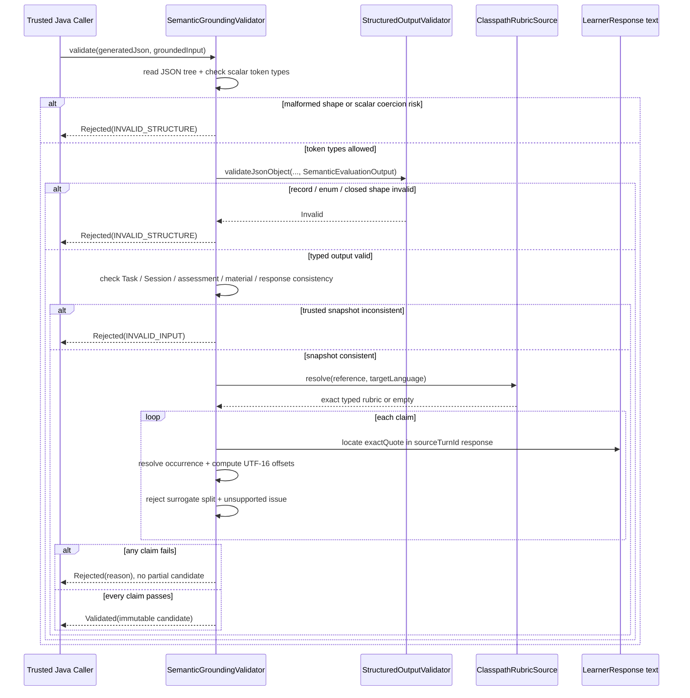

# Grounded Semantic Validation Flow

- Document Status: `IMPLEMENTED`（M1-S7 / M1-S8A）；S8A `READY_TO_COMMIT`
- Feature / Slice: `M1-S7`（本 Flow 主体）；`M1-S8A` owner-scoped read entry
- Last Verified: `2026-09-06`
- Entry: `SemanticGroundingValidator.validate`；`GroundedEvaluationInputReader.readOwned`（S8A）

## 1. Behavior Boundary

本 Flow 描述已经实现的 module-local Grounded Evaluator contract：把不可信 semantic JSON 与可信 Java 调用方
组装的 completed Practice snapshot，转换成引用 learner 原文的 `ValidatedSemanticCandidate`，或返回只含安全
failure category 的 `Rejected`。

S7 本身没有 HTTP、Model、Credential 或 database entry。`GroundedEvaluationInput` 的对象一致性不是 authorization
proof；M1-S8 production flow 必须从 authenticated `UserContext.userId` 出发，通过 owner/profile-scoped Repository
读取 Task、Session、responses 与 deterministic assessment，再按 Task 的 exact material identity 解析 material。
M1-S8A `GroundedEvaluationInputReader.readOwned` 已把该组装前提落实为生产读取入口（见第 6 节）；
M1-S8B `EvaluationRunCreationService.createForReadyInput` 已把该输入原子转换为 durable
`EvaluationRun` + `ModelCallJob`（见 `evaluation-run-creation.md`）；Evaluation outcome / candidate consumption
（S8C）与 Model dispatch / submission（S8D）尚未实现。

本 Flow 不执行 semantic Model call，不持久化 candidate，不修改 completed Session、deterministic assessment、
Evidence、Memory、Weakness、Level 或 Mastery。Grounding 只证明引用来源、位置与 rubric 边界通过 Java 校验，
不证明 diagnosis 语义正确。

## 2. Main Call Chain

## 3. State and Authority

- Authenticated `UserContext.userId` 是未来 S8 production assembler 的 caller identity authority；S7 不接收 HTTP
  identity，也不查询数据库。
- PostgreSQL 已持久化的 `LearningTask`、completed `PracticeSession`、原始 `LearnerResponse` 与
  `DeterministicAssessment` 是练习事实；S7 只读取传入 snapshot，不修改它们。
- immutable material 的 `semanticRubricReference` 与 target language 共同选择 classpath rubric；reference、resource
  内声明与 target language 必须精确匹配。
- 不可信 Model output 只能声明 `sourceTurnId + exactQuote + occurrenceIndex + issueType + explanation + confidence`；
  numeric offsets 由 Java 计算。
- `ValidatedSemanticCandidate` 是 Session-level candidate，不是 verified fact、Evidence qualification 或长期状态。

## 4. Core Validation Rules

1. 在 record binding 前检查原始 JSON token：文本字段必须是 string，`occurrenceIndex` 必须是可表示为 Java
   `int` 的整型 token，`confidence` 必须是 number；拒绝 `1.9 → 1`、`"1" → 1` 与 numeric enum coercion。
2. `StructuredOutputValidator` 拒绝 malformed JSON、unknown / missing / null fields、非法 enum、duplicate key 与
   trailing token。
3. trusted input 必须把同一 user/profile 的 completed Task、completed Session、assessment、exact material 与完整且
   无重复的 response step set 关联起来；这是 fail-closed consistency check，不替代 Repository authorization。
4. quote 在 learner 原文中执行 case-sensitive literal match，不 strip、不做 Unicode normalization 或模糊匹配；
   occurrence 为 0-based，按起点排序并包含重叠匹配。
5. 唯一匹配接受 `-1` 或 `0`；多次匹配必须指定合法 occurrence。Java 保存 UTF-16
   `[startOffset, endOffset)`，span 不得切开 surrogate pair。
6. English rubric `builtin-text-communication-rubric/v1` 当前只允许 `GRAMMAR`、`NATURALNESS` 与
   `TASK_RESPONSE`。rubric 外 issue fail closed。

## 5. Failure / Rejection Paths

- malformed shape、wrong scalar token、closed record binding failure：`INVALID_STRUCTURE`。
- owner/profile/status/identity/response set 不一致：`INVALID_INPUT`。
- rubric 缺失、损坏、reference 或 target language 不匹配：`RUBRIC_UNAVAILABLE`。
- fake turn、quote 不存在、ambiguous 或非法 occurrence、surrogate split、rubric 外 issue、invalid confidence 或
  size limit：返回对应 `RejectionReason`。
- 任一 claim 失败即整批拒绝；先前已临时计算的 claim 不通过 result 暴露。
- `Rejected` 不携带 learner text、完整 Model output 或 explanation；S7 没有持久化或日志 side effect。
- rejection 不回滚、删除或覆盖既有 completed Practice 与 deterministic assessment。

## 6. Owner-Scoped Read Entry（M1-S8A）

S8A 在同一 `evaluator` package 内新增 production 读取入口 `GroundedEvaluationInputReader.readOwned(
languageProfileId, sessionId, userContext)`，返回 sealed `GroundedEvaluationInputResult`：

| Result | 语义 |
|---|---|
| `Ready(GroundedEvaluationInput)` | 已通过 ownership、completion 与 snapshot 完整性检查 |
| `NotFound` | Session 不存在或不属于该 caller/Profile；对外不可区分 |
| `NotCompleted` | owned Session 尚未 completed |
| `MaterialUnavailable` | exact material/scaffold 无法按 Task identity 解析 |
| `InconsistentSnapshot` | durable 数据或依赖返回不满足已完成 Practice 的结构约束 |

固定读取顺序：caller identity 只取自 `UserContext` → `PracticeSessionRepository.findOwned`（ownership 失败
在读取任何 private learner text 之前裁决）→ completion gate → `LearningTaskRepository.findOwned` → owned
assessment 与全部 accepted responses → `LearningMaterialCatalog.findByIdentity`（只按 Task 保存的完整
identity + supportLanguage 精确解析，HISTORICAL_ONLY 版本同样可读，绝不 `listAvailable` 重选或读取最新版本）
→ snapshot 一致性检查（Task/Session 均 COMPLETED、assessment 归属、material identity/target language、
material steps 非空不重复、response step 集合与 material steps 完整相等）→ `Ready`。

入口运行在 Spring bean 的短 readOnly transaction 内，不加 FOR UPDATE、零写入、不调用 Model / Job / Credential；
learner text 原样透传；基础设施异常原样上抛，不吞成业务 failure。`Ready` 只代表输入可用于 evaluation，不代表
Model diagnosis 正确，也不授权长期状态变化。S7 validator 的独立一致性检查保持不变，两者不抽取公共 validator。

## 7. Verification Evidence

- M1-S8A prior unit evidence（2026-09-06）：`GroundedEvaluationInputReaderTests` 18/18 PASS（Ready、
  NotFound/NotCompleted 前置裁决、Task/assessment/material/response 全部 InconsistentSnapshot 分支、HISTORICAL
  exact-identity-only、learner text 原样透传、基础设施异常传播、readOnly transaction 注解契约、AfterEach 零
  persistence mutation）；affected regression `SemanticGroundingValidatorTests` 33/33、`ClasspathRubricSourceTests`
  22/22、`LearningTaskPlanningServiceTests` 18/18、`PracticeSessionApplicationServiceTests` 33/33 PASS。
- M1-S8A Codex unit regression：Reader 18/18 + validator 33/33 + rubric 22/22 = 73/73 PASS。
- M1-S8A Codex final external verification（2026-09-06）：disposable PostgreSQL 18.6 empty schema Flyway
  V1–V10 10/10 PASS；正常 MyBatis cache 配置下 `GroundedEvaluationInputReaderIntegrationTests` 5/5 与
  `SemanticGroundingIntegrationTests` 3/3 PASS（0 failures / 0 errors / 0 skipped）。覆盖 wrong owner / 另一
  Profile 隔离、读取前后零 mutation、Reader → S7 Validator durable text offsets；测试数据回滚，临时容器已清理。
- 首轮 integration 的 2 个 test-level findings 已关闭：移除重复 submit 的 Accepted 断言；JdbcTemplate 删除
  fixture 后在测试内清理 `SqlSessionTemplate` 一级缓存，零写入前后比较同样清缓存再读。未修改 Production
  cache 配置；早期 environment-gated skipped 不作为 PASS。Critical / delta Review PASS，S8A READY_TO_COMMIT；
  按用户决定不单独 Explain Back，正式 Ownership Check 留到 S8 完整闭环后。
- source extraction delta（2026-09-06）：`SemanticGroundingValidatorTests` 33/33、`ClasspathRubricSourceTests`
  22/22，本地合计 55/55 PASS；`SemanticGroundingIntegrationTests` 3 个因未设置 `RUN_DATABASE_TESTS` 而跳过，
  按用户要求未重跑外部数据库或容器验证。
- `SemanticGroundingValidatorTests`: 33/33 PASS；覆盖合法 offsets、空 candidate、overlapping occurrence、malformed /
  forged output、scalar coercion、fake/cross-session turn、case/NFC、surrogate、Japanese literal algorithm、rubric
  allowlist、whole-batch rejection 与 immutable result。
- `ClasspathRubricSourceTests`: 22/22 PASS；覆盖真实 English rubric、unsafe reference、unknown language、损坏或
  不完整 resource 与 strict binding。
- `StructuredOutputValidatorTests`: 7/7 affected regression PASS。
- disposable PostgreSQL 18.6 + pgvector 0.8.6 empty database：Flyway V1–V10 10/10；
  `SemanticGroundingIntegrationTests` 3/3 与 affected integration 50/50 PASS。
- final wider server regression：622 tests / 0 failures / 0 errors / 11 Redis 或 Redis+login conditional skips。
- `git diff --check`: PASS。

## 8. Source References

- `server/src/main/java/com/dailylanguage/evaluator/application/SemanticGroundingValidator.java`
- `server/src/main/java/com/dailylanguage/evaluator/application/RubricSource.java`
- `server/src/main/java/com/dailylanguage/evaluator/application/ClasspathRubricSource.java`
- `server/src/main/java/com/dailylanguage/evaluator/application/GroundedEvaluationInputReader.java`（M1-S8A）
- `server/src/main/java/com/dailylanguage/evaluator/application/GroundedEvaluationInputResult.java`（M1-S8A）
- `server/src/main/java/com/dailylanguage/evaluator/domain/GroundedEvaluationInput.java`
- `server/src/main/java/com/dailylanguage/evaluator/domain/SemanticEvaluationOutput.java`
- `server/src/main/java/com/dailylanguage/evaluator/domain/SemanticEvaluationRubric.java`
- `server/src/main/java/com/dailylanguage/evaluator/domain/SemanticGroundingResult.java`
- `server/src/main/resources/evaluator/rubrics/builtin-text-communication-rubric/v1.json`
- `server/src/main/java/com/dailylanguage/modelgateway/structuredoutput/StructuredOutputValidator.java`
- `server/src/test/java/com/dailylanguage/evaluator/application/SemanticGroundingValidatorTests.java`
- `server/src/test/java/com/dailylanguage/evaluator/application/ClasspathRubricSourceTests.java`
- `server/src/test/java/com/dailylanguage/evaluator/application/SemanticGroundingIntegrationTests.java`
- `server/src/test/java/com/dailylanguage/evaluator/application/GroundedEvaluationInputReaderTests.java`（M1-S8A）
- `server/src/test/java/com/dailylanguage/evaluator/application/GroundedEvaluationInputReaderIntegrationTests.java`（M1-S8A）
