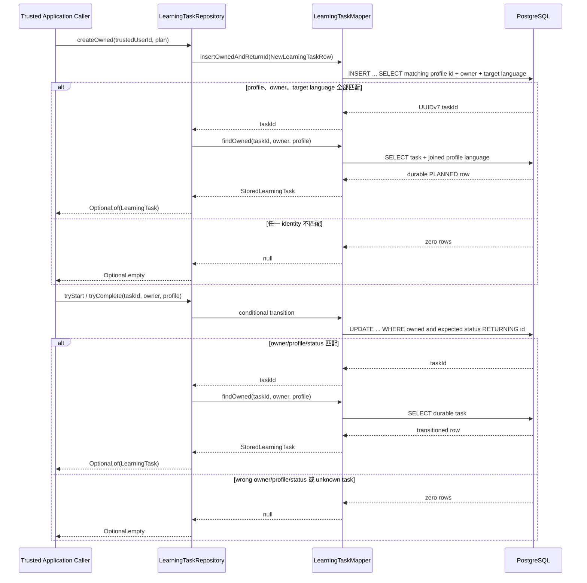
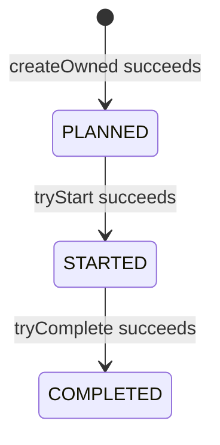

# LearningTask Persistence Flow

- Document Status: `IMPLEMENTED`
- Feature / Slice: `M1-S3`
- Last Verified: `2026-09-04`
- Entry: `LearningTaskRepository.createOwned / findOwned / tryStart / tryComplete`

## 1. Behavior Boundary

本 Flow 描述已经实现的 module-local LearningTask persistence：把 S2 产生的 `LearningTaskPlan` 持久化为
PostgreSQL-backed durable `LearningTask`，以可信 `trustedUserId`、`languageProfileId` 和 Profile target language
共同裁决创建权限，并提供 owner/profile-scoped read 与单向 lifecycle transition。

自 M1-S4 起，authenticated 调用入口是 owner-scoped planning HTTP API（见
[`owner-scoped-learning-task-planning.md`](owner-scoped-learning-task-planning.md)）；`trustedUserId` 由
该 Application flow 从 authenticated `UserContext` 提供。`LearningTaskPlan` 不是 authorization proof。
本 Flow 自身不创建 `PracticeSession`、保存 learner response、调用 Model，或修改 Evidence、Weakness、
Level、Mastery、Memory。

## 2. Main Call Chain

`createOwned`、`tryStart` 与 `tryComplete` 各自在 Spring transaction 内完成 mutation 与 owned reread。
所有 SQL value 都通过 MyBatis `#{...}` parameter binding 传入。

## 3. State and Authority

- PostgreSQL 是 `taskId`、status 与 lifecycle timestamps 的 authority；`id` 使用 PostgreSQL 18 `uuidv7()`。
- `learning_task.user_id + language_profile_id` 通过 composite FK 引用
  `language_profile(id, user_id)`，防止跨 User Profile 归属。
- 创建使用单条 `INSERT ... SELECT` 同时验证可信 owner、Profile identity 与 Profile target language，避免
  check-then-insert race。
- `materialId + publishedVersion` 保存 Planner 选定的 exact immutable material identity；不跟随 Catalog 新版本。
- target language 不在 `learning_task` 重复存储，owned read 从同一 `language_profile` row 还原。
- support language、difficulty、duration、task type、planning reason、status、文本边界与 timestamp shape 由
  PostgreSQL constraints 保护；Java `LearningTask` 在恢复 snapshot 时再次验证 domain invariant。
- 本 Flow 不保存 Content 本体、Prompt、Credential、learner response、Evidence 或长期学习状态。

## 4. State Transition

合法 transition 由 `taskId + trustedUserId + languageProfileId + current status` conditional update 原子裁决。
重复、跳级、逆向、wrong-owner、wrong-profile 或 unknown task 请求返回 `Optional.empty`，原状态不变。
当前只有线性 lifecycle，status predicate 已提供一次性 transition；本 slice 不引入 `rowVersion` 或通用状态机。

## 5. Failure / Rejection Paths

- unknown Profile、wrong owner 或 target language 与 Profile 不匹配：创建零行并返回 `Optional.empty`，不泄露是
  “不存在”还是“不属于 caller”。
- wrong owner/profile read：返回 `Optional.empty`。
- 非法或重复 transition：conditional update 更新零行并返回 `Optional.empty`。
- null identity argument：Repository 在访问数据库前 fail fast。
- durable constraint、Flyway、connection 或其他 infrastructure failure：异常显式向上传播，不伪装为业务 empty。
- mutation 已返回 id 但同事务 owned reread 缺行：Repository 抛出固定 `IllegalStateException`；不返回虚构 snapshot。

## 6. Verification Evidence

- `LearningTaskTests`: 7/7 PASS；验证 snapshot identity、文本、duration 与 lifecycle timestamp invariants。
- `LearningTaskPersistenceIntegrationTests`: 10/10 PASS；验证 UUIDv7、exact plan round-trip、owner/profile/target
  language isolation、owned read、合法/非法 transition 与 durable constraint failure。
- fresh disposable PostgreSQL 18.6 database：Flyway V1–V8 validated 8/8、applied 8/8，schema version `v8`。
- schema inspection：16 个预期字段、UUIDv7 default、composite ownership FK，以及 enum、duration、文本与 lifecycle
  constraints 均存在。
- full server regression：419 tests / 0 failures / 0 errors / 11 Redis 或 Redis+login environment-gated skips。
- 验证数据库 `daily_language_m1_s3_verify_20260904` 已在检查完成后删除；未修改 primary `daily_language`。

## 7. Source References

- `server/src/main/java/com/dailylanguage/planner/domain/LearningTask.java`
- `server/src/main/java/com/dailylanguage/planner/domain/LearningTaskPlan.java`
- `server/src/main/java/com/dailylanguage/planner/infrastructure/LearningTaskRepository.java`
- `server/src/main/java/com/dailylanguage/planner/infrastructure/LearningTaskMapper.java`
- `server/src/main/resources/mapper/LearningTaskMapper.xml`
- `server/src/main/resources/db/migration/V8__add_learning_task.sql`
- `server/src/test/java/com/dailylanguage/planner/domain/LearningTaskTests.java`
- `server/src/test/java/com/dailylanguage/planner/infrastructure/LearningTaskPersistenceIntegrationTests.java`
