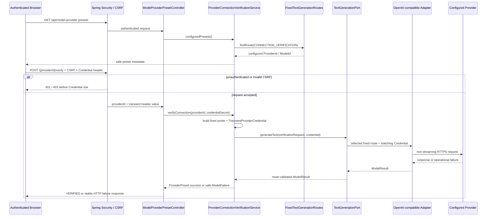

# Model Provider Connection Verification Flow

- Document Status: `IMPLEMENTED`
- Feature / Slice: `M0-S7D`
- Last Verified: `2026-08-31`
- Entry: `GET /api/model-provider-presets`；`POST /api/model-provider-presets/{providerId}/verify`

## 1. Behavior Boundary

本 Flow 描述已实现的 authenticated Provider preset discovery 与 transient Credential verification。调用方先读取
当前 fixed `CONNECTION_VERIFICATION` route 的安全 Provider / Model metadata，再通过 authenticated request header
提交一次性 Credential。Backend 使用固定 probe request 调用现有 `TextGenerationPort`，但不返回或保存 Model
生成文本。

本 Flow 不包含 Browser local/session storage UI、动态 Provider / Model selection、custom endpoint、live DeepSeek
Credential verification、Structured Output、Trace、retry / fallback、`ModelCallJob` 或 Learning State mutation。因此
它是 Backend Credential API ingress complete，不是 Hosted TLS、Browser UI → live Provider 的完整产品
End-to-End evidence。

## 2. Main Call Chain

## 3. State and Authority

- `FixedTextGenerationRoutes` remains Provider / Model / endpoint authority；path `providerId` 只限定 Credential scope，
  不能改变 selected route。
- Spring Security 保证 authenticated Session / CSRF boundary；Hosted HTTPS / TLS 由 deployment boundary 负责，
  当前测试没有验证 channel enforcement。
- Client 不提交 Prompt、ModelId、endpoint 或 protocol；Service 使用固定 connection probe。
- Credential 只存在于 request header、Controller method、`TransientProviderCredential`、Executor task 与 outbound
  Authorization header 的当前内存调用链。
- Model output 在 Service 成功映射时被丢弃，只返回 selected ProviderId / ModelId。
- 当前行为不读写 PostgreSQL、Redis、Trace、Learning Memory、Language Profile 或其他业务状态。

## 4. State Transition

本 Flow 没有持久化状态。每次 POST 都是独立同步 verification；失败不会保存 Credential、自动 retry、切换
Provider 或产生 Learning Evidence。

## 5. Failure / Rejection Paths

- unauthenticated / missing CSRF：Spring Security 在 Controller 前返回 401 / 403；
- missing / blank Credential 或非法 ProviderId：400，不调用 Model Gateway；
- route 与 Credential Provider 不匹配、Provider 拒绝 Credential：422；
- rate limit：429，并只转发安全 positive `Retry-After`；
- final Gateway timeout：504；capability / temporary unavailable：503；request / Provider failure：502；
- response 不包含 Credential、Provider raw body、generated text、exception message 或 stack trace；
- timeout cancellation 仍为 best effort，不承诺 worker 已停止或 Credential 立即从 JVM heap 消失。

## 6. Verification Evidence

- `ProviderConnectionVerificationServiceTests`: preset projection、fixed probe、Credential propagation、generated text
  discard 与 typed failure preservation；
- `ModelProviderPresetControllerTests`: authentication、CSRF、missing Credential、safe success / authentication failure、
  rate limit / Retry-After 与 secret non-disclosure；
- `TextGenerationGatewayConfigurationTests`: default DeepSeek verification route、OpenAI config-only replacement；
- focused S7D tests: 16/16 PASS；
- Model Gateway regression: 77/77 PASS；
- server regression: 217 total / 0 failures / 0 errors / 33 environment-skipped。

所有测试使用 fake Credential 与 mocked boundary；未发送 live DeepSeek request。

## 7. Source References

- `server/src/main/java/com/dailylanguage/modelgateway/api/ModelProviderPresetController.java`
- `server/src/main/java/com/dailylanguage/modelgateway/application/ProviderConnectionVerificationService.java`
- `server/src/main/java/com/dailylanguage/modelgateway/routing/ModelPurpose.java`
- `server/src/main/java/com/dailylanguage/modelgateway/text/TextGenerationPort.java`
- `server/src/main/resources/model-gateway.yml`
- `server/src/test/java/com/dailylanguage/modelgateway/api/ModelProviderPresetControllerTests.java`
- `server/src/test/java/com/dailylanguage/modelgateway/application/ProviderConnectionVerificationServiceTests.java`
- `server/src/test/java/com/dailylanguage/modelgateway/infrastructure/TextGenerationGatewayConfigurationTests.java`
