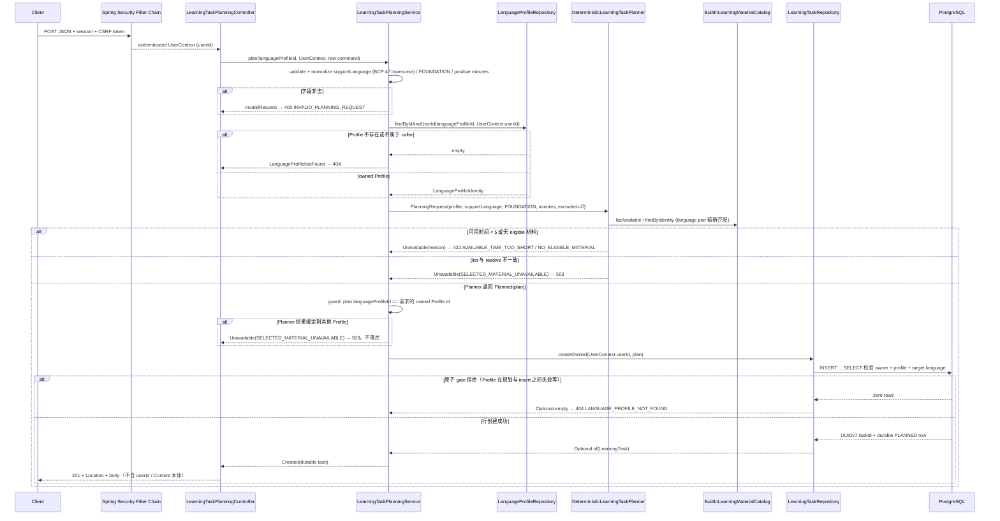

# Owner-scoped LearningTask Planning Flow

- Document Status: `IMPLEMENTED`
- Feature / Slice: `M1-S4`
- Last Verified: `2026-09-04`
- Entry: `POST /api/language-profiles/{languageProfileId}/learning-tasks`

## 1. Behavior Boundary

本 Flow 描述已经实现的 owner-scoped planning HTTP API：authenticated 用户在**自己拥有的**
`LanguageProfile` 下请求一次 Built-in LearningTask planning，服务端通过 explicit Application Service
串联 owned Profile 校验、deterministic Planner 与 durable create，成功返回数据库创建后的
`PLANNED` task。

明确不负责的行为：

- 不提供 GET、start、complete task HTTP endpoint（lifecycle transition 仍由 M1-S3 repository 承担）；
- 不创建 `PracticeSession`、不保存 learner response、不调用 Model、不修改 Evidence / Weakness /
  Level / Mastery / Memory；
- 不暴露 `excludedMaterials`，skip / replace / easier / harder / topic selection 不在当前 contract；
- POST 是非幂等操作：每次成功请求代表一次新的 planning intent，concurrent 或 retried 请求允许
  产生多个 `PLANNED` task；客户端不得对不确定结果自动重试。

## 2. Main Call Chain

成功响应的每个字段都来自数据库返回的 durable `LearningTask`（exact `materialId + publishedVersion`
保持不变），不是未持久化的 `LearningTaskPlan`。

## 3. State and Authority

- `userId` 的唯一 ownership authority 是 Spring Security 建立的 `UserContext`；request body、query
  parameter、header 中的任何 identity 字段都不参与授权判断，成功响应也不回传 `userId`。
- Profile 归属有三层 defense in depth：
  1. `findProfileOwnedByUser` 要求 profile id 与认证 userId 同时命中，wrong-owner 在进入 Planner 前被拒绝；
  2. Application 在持久化前校验 Planner 结果仍绑定请求的 `languageProfileId`——`LearningTaskPlanner`
     是可被后续 slice 替换 / 组合的 port，boundary 不隐式信任当前 deterministic 实现；
  3. `INSERT ... SELECT` 在数据库内原子重校验 owner、profile 与 target language，empty 即 fail closed 为 404。
- `languageProfileId` hard isolation：材料按 language pair 精确匹配，无 cross-language fallback；不同
  目标语言的 Profile 之间不共享任何 planning 结果。
- 本 Flow 全程无 LLM、无 Model Call、无 Credential；planning 由 provider-free 的 Java hard constraints
  与 Built-in catalog deterministic 完成。unavailable / 拒绝路径不产生任何数据库 mutation，不污染
  Persistent Learning State。
- 不记录完整 request body、Content scaffold 本体、内部 exception detail；业务失败只暴露 stable code。

## 4. State Transition

本 slice 只产生新的 `PLANNED` row，不推进 lifecycle；`PLANNED → STARTED → COMPLETED` 的单向迁移语义
见 [`learning-task-persistence.md`](learning-task-persistence.md)。

## 5. Failure / Rejection Paths

| 条件 | HTTP | code | DB mutation |
|---|---:|---|---|
| unauthenticated | 401 | 既有 authentication contract | none |
| missing / invalid CSRF | 403 | 既有 CSRF contract | none |
| malformed JSON / 字段类型错误 | 400 | framework-safe response | none |
| supportLanguage 非 1–35 字符 BCP 47、difficulty 非 `FOUNDATION`、minutes 非正整数 | 400 | `INVALID_PLANNING_REQUEST` | none |
| unknown 或 wrong-owner Profile | 404 | `LANGUAGE_PROFILE_NOT_FOUND`（两者不可区分） | none |
| available time < 5 分钟 | 422 | `AVAILABLE_TIME_TOO_SHORT` | none |
| 无 eligible 材料（含跨语言 mismatch） | 422 | `NO_ELIGIBLE_MATERIAL` | none |
| list / resolve Content 不一致，或 Planner 结果绑定到非请求 Profile | 503 | `SELECTED_MATERIAL_UNAVAILABLE` | none |
| durable create gate 零行（Profile 在规划与 insert 之间失效） | 404 | `LANGUAGE_PROFILE_NOT_FOUND` | none |
| unexpected DB / infrastructure failure | generic 5xx | 不暴露 exception detail | transaction rollback |

未处理异常不被捕获并伪装成业务错误码，直接交给容器由 Boot 默认 error rendering 输出 sanitized 5xx。

## 6. Verification Evidence

以下均为 2026-09-04 fresh 运行：

- `LearningTaskPlanningServiceTests`：18/18 PASS；覆盖 owned Profile success（含 ` ZH-CN ` → `zh-cn`
  规范化与 trusted userId 双重传递）、Profile 拒绝先于 Planner、三个 unavailable 分支零持久化、
  1–4 分钟正向转发 Planner、durable create empty fail closed、Planner 返回同一 user 另一 Profile 的
  plan 时 fail closed 且 Repository 零交互、9 组 invalid request 在 Profile 读取前拒绝、null 参数 fail fast。
- `LearningTaskPlanningControllerTests`：12/12 PASS；覆盖 401 / 403 / 400（framework-safe 与
  `INVALID_PLANNING_REQUEST`）/ 404 / 422×2 / 503 / 201、CSRF、body+header+query 三处 userId spoof
  被忽略且响应无 `userId`、Location/body 来自 durable snapshot、single-user mode 同一 ownership 路径、
  未处理异常不被映射为业务响应。
- `LearningTaskPlanningIntegrationTests`（真实 PostgreSQL + 真实 Built-in catalog + 真实 Repository）：
  7/7 PASS；row inspection 断言 `material_id='en-builtin-cafe-request'`、`published_version='v1'`、
  `status='PLANNED'`、`user_id` 归属；unknown / wrong-owner 同一 404 语义且零 mutation；`ja` Profile
  跨语言 `NO_ELIGIBLE_MATERIAL` 零 mutation。
- 受影响 S3 回归 `LearningTaskPersistenceIntegrationTests`：10/10 PASS。
- disposable PostgreSQL 18.6 空库：Flyway V1–V8 applied 8/8、`flyway_schema_history` 全部 success；
  事务回滚后 `learning_task` 0 行。
- wider server regression（DB + Redis gates 开启）：456 tests / 0 failures / 0 errors / 3 skips
  （均为要求 Redis 停机的 `RedisSessionUnavailable*`，当前 Redis 运行中属预期）。
- 验证数据库 `daily_language_m1_s4_verify_20260904` 已删除；未修改 primary `daily_language`。

## 7. Source References

- `server/src/main/java/com/dailylanguage/planner/api/LearningTaskPlanningController.java`
- `server/src/main/java/com/dailylanguage/planner/application/LearningTaskPlanningService.java`
- `server/src/main/java/com/dailylanguage/planner/application/LearningTaskPlanningResult.java`
- `server/src/main/java/com/dailylanguage/planner/application/DeterministicLearningTaskPlanner.java`
- `server/src/main/java/com/dailylanguage/languageprofile/application/LanguageProfileAccessService.java`
- `server/src/main/java/com/dailylanguage/planner/infrastructure/LearningTaskRepository.java`
- `server/src/test/java/com/dailylanguage/planner/application/LearningTaskPlanningServiceTests.java`
- `server/src/test/java/com/dailylanguage/planner/api/LearningTaskPlanningControllerTests.java`
- `server/src/test/java/com/dailylanguage/planner/application/LearningTaskPlanningIntegrationTests.java`
