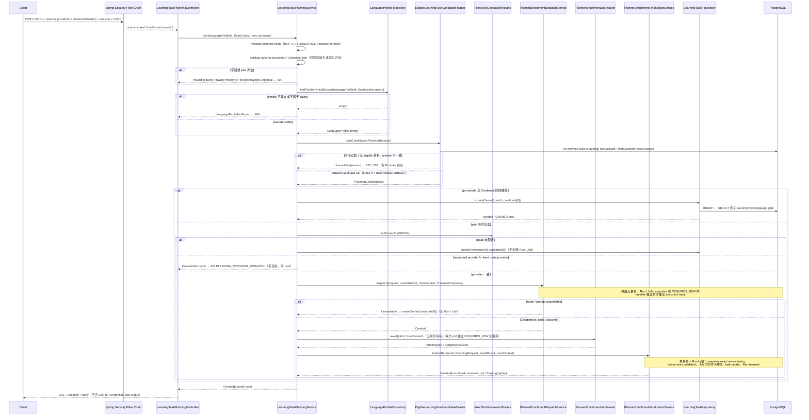

# Owner-scoped LearningTask Planning Flow

- Document Status: `IMPLEMENTED`
- Feature / Slice: `M1-S4 / M1-S9F`
- Last Verified: `2026-09-16`
- Entry: `POST /api/language-profiles/{languageProfileId}/learning-tasks`

## 1. Behavior Boundary

本 Flow 描述已经实现的 owner-scoped planning HTTP API：authenticated 用户在**自己拥有的**
`LanguageProfile` 下请求一次 Built-in LearningTask planning。无 Model 参数时完全保持 M1-S4 的
deterministic planning；请求携带 optional `providerId`（body）+ Provider Credential
（`X-Model-Provider-Credential` header）pair 时，复用 S9A–S9E2B 的 optional Planner enrichment
durable 链路（candidate snapshot → Run / Job dispatch → bounded wait → 原子 finalization），
成功响应始终返回数据库创建后的 durable `LearningTask`（enriched 或 deterministic fallback）。

明确不负责的行为：

- 不提供 GET、start、complete task HTTP endpoint（lifecycle transition 仍由 M1-S3 repository 承担）；
- 不创建 `PracticeSession`、不保存 learner response、不修改 Evidence / Weakness / Level / Mastery /
  Memory——enrichment 只影响本次 task 的 material 选择与 bounded recommendation reason；
- 不暴露 `excludedMaterials`，skip / replace / easier / harder / topic selection 不在当前 contract；
- Provider 调用只能经由 fixed `PLANNING` route 的 exact provider；不提供动态 provider 选择；
- POST 是非幂等操作：每次成功请求代表一次新的 planning intent（新的 task，enrichment 模式下还是
  新的 Run / Job）；客户端不得对不确定结果自动重试；
- wait budget 耗尽只结束本次交互等待，异步 Worker 与 Job 的 durable 生命周期继续由既有
  model-call-job 边界管理，本 endpoint 不提供 reconciliation API。

## 2. Main Call Chain

```mermaid
sequenceDiagram
    participant Client
    participant Security as Spring Security Filter Chain
    participant Controller as LearningTaskPlanningController
    participant Service as LearningTaskPlanningService
    participant ProfileRepo as LanguageProfileRepository
    participant Reader as EligibleLearningTaskCandidateReader
    participant Routes as FixedTextGenerationRoutes
    participant Dispatch as PlannerEnrichmentDispatchService
    participant Awaiter as PlannerEnrichmentJobAwaiter
    participant Finalizer as PlannerEnrichmentFinalizationService
    participant TaskRepo as LearningTaskRepository
    participant DB as PostgreSQL

    Client->>Security: POST JSON (+ optional providerId / credential header) + session + CSRF
    Security-->>Controller: authenticated UserContext (userId)
    Controller->>Service: plan(languageProfileId, UserContext, raw command)

    Service->>Service: validate planning fields（BCP 47 / FOUNDATION / positive minutes）
    Service->>Service: validate optional providerId / Credential pair（仅同时缺失或同时合法）
    alt 字段或 pair 非法
        Service-->>Controller: InvalidRequest / InvalidProviderId / InvalidProviderCredential → 400
    end

    Service->>ProfileRepo: findProfileOwnedByUser(languageProfileId, UserContext.userId)
    alt Profile 不存在或不属于 caller
        ProfileRepo-->>Service: empty
        Service-->>Controller: LanguageProfileNotFound → 404
    else owned Profile
        ProfileRepo-->>Service: LanguageProfileIdentity
    end

    Service->>Reader: readCandidates(PlanningRequest)
    Reader->>DB: (in-memory built-in catalog) listAvailable / findByIdentity exact resolve
    alt 时间过短 / 无 eligible 材料 / resolve 不一致
        Reader-->>Service: Unavailable(reason) → 422 / 503，零 Provider 调用
    else ordered candidate set（index 0 = deterministic fallback）
        Reader-->>Service: PlanningCandidateSet
    end

    alt providerId 与 Credential 同时缺失
        Service->>TaskRepo: createOwned(userId, candidate[0])
        TaskRepo->>DB: INSERT ... SELECT 原子 owner/profile/language gate
        TaskRepo-->>Service: durable PLANNED task
    else pair 同时合法
        Service->>Routes: findRoute(PLANNING)
        alt route 未配置
            Service->>TaskRepo: createOwned(userId, candidate[0])（不创建 Run / Job）
        else requested provider != fixed route provider
            Service-->>Controller: ProviderMismatch → 422 PLANNING_PROVIDER_MISMATCH（零调用、零 task）
        else provider 一致
            Service->>Dispatch: dispatch(request, candidateSet, UserContext, TransientCredential)
            Note over Dispatch,DB: 外层无事务：Run / Job / snapshot 在 REQUIRES_NEW 内<br/>durable 提交后才提交 execution input
            alt route / prompt unavailable
                Dispatch-->>Service: Unavailable → createOwned(candidate[0])（无 Run / Job）
            else Created(run, jobId, outcome)
                Dispatch-->>Service: Created
                Service->>Awaiter: await(jobId, UserContext)（无事务等待；每次 poll 独立 REQUIRES_NEW 读事务）
                Awaiter-->>Service: Terminal(job) / BudgetExhausted
                Service->>Finalizer: finalizeRun(runId, PlanningRequest, awaitResult, UserContext)
                Note over Finalizer,DB: 单事务 + Run 行锁：snapshot exact re-resolution、<br/>output strict validation、Job CONSUMED、task create、Run terminal
                Finalizer-->>Service: Created(bound task, terminal run) / Existing(replay)
            end
        end
    end

    Service-->>Controller: Created(durable task)
    Controller-->>Client: 201 + Location + body（不含 userId / Credential / raw output）
```

成功响应的每个字段都来自数据库返回的 durable `LearningTask`（exact `materialId + publishedVersion`
保持不变）；`recommendationReason` 只有 `MODEL_ENRICHED` 行携带（已通过 S9B bounded validation），
deterministic fallback 为 `null`。

## 3. State and Authority

- `userId` 的唯一 ownership authority 是 Spring Security 建立的 `UserContext`；request body、query
  parameter、header 中的任何 identity 字段（包括 `providerId` / Credential）都不参与授权判断，
  成功响应也不回传 `userId`。
- Profile 归属的多层 defense in depth 保持不变：
  1. `findProfileOwnedByUser` 要求 profile id 与认证 userId 同时命中；
  2. candidate / task 的所有 identity 都由 Java（Reader / Finalizer）从 request 绑定的 owned
     profile 重建，Model 只能在 offered snapshot member 内声明选择；
  3. `INSERT ... SELECT` 与 Run finalize 的 EXISTS gate 在数据库内原子重校验。
- `languageProfileId` hard isolation：材料按 language pair 精确匹配，Run / Job / snapshot /
  task 全部 owner + profile 绑定，无 cross-language fallback。
- LLM 边界：enrichment output 只是 candidate selection + bounded reason 的 soft decision；
  schema / enum / identity / qualification / persistence authority 全部在 Java 与 PostgreSQL
  （S9B validator、S9E2B finalizer）。Model failure / capacity rejection / invalid output /
  wait exhaustion 只影响本次 task 选择，不污染 Persistent Learning State。
- Credential 只存在于当前内存调用链（header → Service → DispatchCommand → Worker → Provider
  adapter），不进入 DB、response、exception message、log 或 trace；`TransientProviderCredential`
  的 `toString` 持续 redacted。
- 事务边界：HTTP-facing Service 禁止事务（`Propagation.NEVER`），等待与 Model 调用不持有任何
  数据库事务；Run / Job 创建（REQUIRES_NEW）、finalization（单事务 + Run 行锁）沿用 S9C2 / S9E2B
  既有边界。polling 可见性：`NEVER` 场景下的 empty-transaction synchronization 会让共享
  SqlSessionTemplate 把首次 poll 的 SqlSession 绑定到线程，MyBatis first-level cache 因此跨 poll
  返回 stale Job 状态——awaiter 的每次 poll 都在独立 `REQUIRES_NEW` 读事务内执行，获得全新
  session 与数据库快照，且不改变共享 Repository 在 finalizer 原子事务内的读取语义。

## 4. State Transition

- 两条路径都只产生新的 `PLANNED` `learning_task` row；`PLANNED → STARTED → COMPLETED` 语义见
  [`learning-task-persistence.md`](learning-task-persistence.md)。
- enrichment 路径额外产生 `PlanningRun` 生命周期：`PENDING → MODEL_APPLIED`（绑定唯一
  MODEL_ENRICHED task）或 `PENDING → FALLBACK_APPLIED`（绑定唯一 deterministic task + closed
  FallbackReason），迁移语义见 S9E2A/E2B 实现与
  [`evaluation-result-consumption.md`](evaluation-result-consumption.md) 的同族模式。
- terminal Run replay（并发同 run 或重复 finalize 调用）只读取 bound task，不重复创建。

## 5. Failure / Rejection Paths

| 条件 | HTTP | code | DB mutation |
|---|---:|---|---|
| unauthenticated | 401 | 既有 authentication contract | none |
| missing / invalid CSRF | 403 | 既有 CSRF contract | none |
| malformed JSON / 字段类型错误 | 400 | framework-safe response | none |
| planning 字段非法 | 400 | `INVALID_PLANNING_REQUEST` | none |
| providerId 非法 / blank / 与 Credential 不成对 | 400 | `INVALID_PROVIDER_ID` | none |
| providerId 存在但 Credential 缺失 / blank | 400 | `INVALID_PROVIDER_CREDENTIAL` | none |
| requested provider 与 fixed PLANNING route 不一致 | 422 | `PLANNING_PROVIDER_MISMATCH` | none（零 Provider 调用） |
| unknown 或 wrong-owner Profile | 404 | `LANGUAGE_PROFILE_NOT_FOUND`（两者不可区分） | none |
| available time < 5 分钟 | 422 | `AVAILABLE_TIME_TOO_SHORT` | none |
| 无 eligible 材料（含跨语言 mismatch） | 422 | `NO_ELIGIBLE_MATERIAL` | none |
| list / resolve Content 不一致 / finalizer snapshot re-resolution 失败 | 503 | `SELECTED_MATERIAL_UNAVAILABLE` | enrichment 模式下可能已提交 Run / Job，但零 task |
| fixed PLANNING route / prompt unavailable | — | 落 deterministic fallback | 无 Run / Job，一个 deterministic task |
| Model failure / capacity rejection / invalid output / wait exhaustion | 201 | —（`planningReason=DETERMINISTIC_BUILT_IN_FALLBACK`） | fallback task + Run `FALLBACK_APPLIED`（closed reason） |
| Model 选择通过 validation | 201 | —（`planningReason=MODEL_ENRICHED` + bounded reason） | enriched task + Run `MODEL_APPLIED` + Job `CONSUMED` |
| durable create gate 零行（deterministic 路径） | 404 | `LANGUAGE_PROFILE_NOT_FOUND` | none |
| dispatch 后 invariant / DB 异常（含 finalizer NotFound） | generic 5xx | 不暴露 exception detail | finalizer 事务回滚，不创建替代 task |

未处理异常不被捕获并伪装成业务错误码，直接交给容器由 Boot 默认 error rendering 输出 sanitized 5xx。

## 6. Verification Evidence

- 2026-09-15 fresh（local，无外部依赖）：`LearningTaskPlanningServiceTests` 36/36 PASS、
  `LearningTaskPlanningControllerTests` 17/17 PASS、`PlannerEnrichmentJobAwaiterTests` 10/10 PASS
  （含每次 poll 独立 `REQUIRES_NEW` 读事务的回归）、全量 server unit suite 0 failures；覆盖
  deterministic 兼容、pair 400（含 both-blank / blank-single：blank 是"出现"而非"缺失"）、
  mismatch 422、route / dispatch unavailable fallback、dispatch→await→finalize 同一
  PlanningRequest 实例、capacity / Existing / NotFound / Unavailable 映射、recommendationReason
  投影与 Credential 不进响应。
- 2026-09-15 fresh PostgreSQL 18.6 + pgvector 0.8.6 fake-worker integration：empty schema
  Flyway V1–V17 通过，`LearningTaskPlanningIntegrationTests` 12/12 PASS；覆盖无参数兼容 201、
  valid enrichment 全链路 Run/Job/snapshot/task/finalize + exactly-one task + secret absence、
  Model failure fallback、mismatch 422 零调用、pair 400 零 mutation，不访问真实 Provider。
- 2026-09-16 fresh affected PostgreSQL regression：Planner / ModelCallJob / Practice / Evaluator
  19 个 integration classes，186/186 PASS；café v2 exact step identity、非事务 planning 边界、
  Evaluator durable read / dispatch / consume 与显式测试清理均通过。
- `git diff --check` 通过。

## 7. Source References

- `server/src/main/java/com/dailylanguage/planner/api/LearningTaskPlanningController.java`
- `server/src/main/java/com/dailylanguage/planner/application/LearningTaskPlanningService.java`
- `server/src/main/java/com/dailylanguage/planner/application/LearningTaskPlanningResult.java`
- `server/src/main/java/com/dailylanguage/planner/application/EligibleLearningTaskCandidateReader.java`
- `server/src/main/java/com/dailylanguage/planner/application/PlannerEnrichmentDispatchService.java`
- `server/src/main/java/com/dailylanguage/planner/application/PlannerEnrichmentJobAwaiter.java`
- `server/src/main/java/com/dailylanguage/planner/application/PlannerEnrichmentFinalizationService.java`
- `server/src/main/java/com/dailylanguage/modelgateway/text/execution/FixedTextGenerationRoutes.java`
- `server/src/main/java/com/dailylanguage/languageprofile/application/LanguageProfileAccessService.java`
- `server/src/main/java/com/dailylanguage/planner/infrastructure/LearningTaskRepository.java`
- `server/src/test/java/com/dailylanguage/planner/application/LearningTaskPlanningServiceTests.java`
- `server/src/test/java/com/dailylanguage/planner/api/LearningTaskPlanningControllerTests.java`
- `server/src/test/java/com/dailylanguage/planner/application/LearningTaskPlanningIntegrationTests.java`
