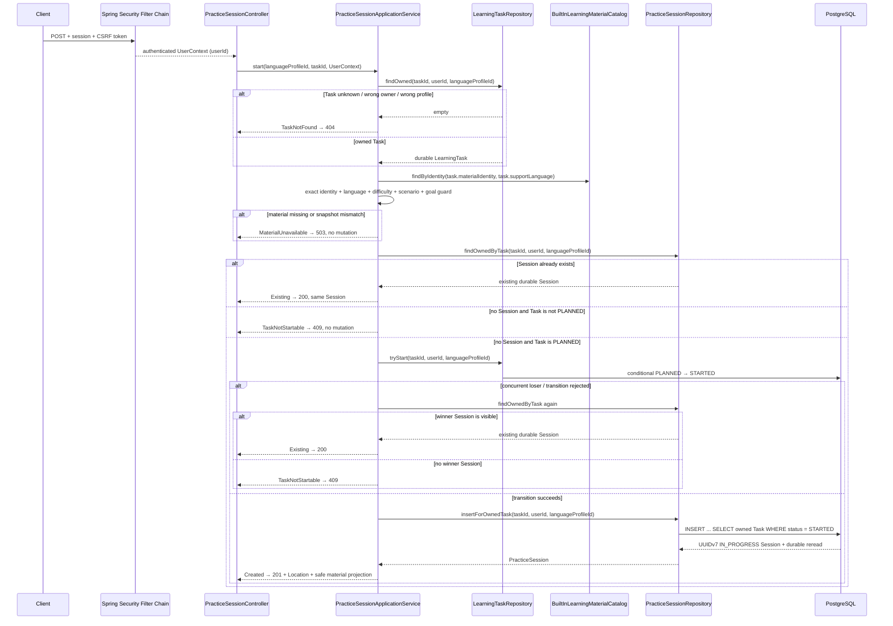
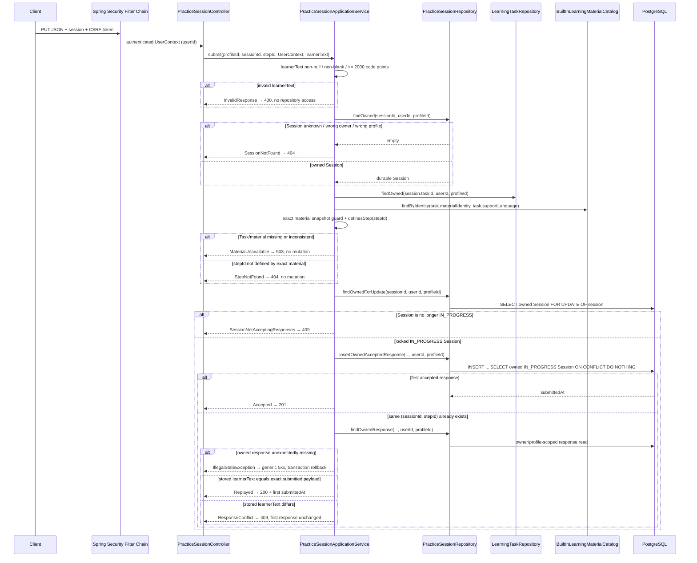
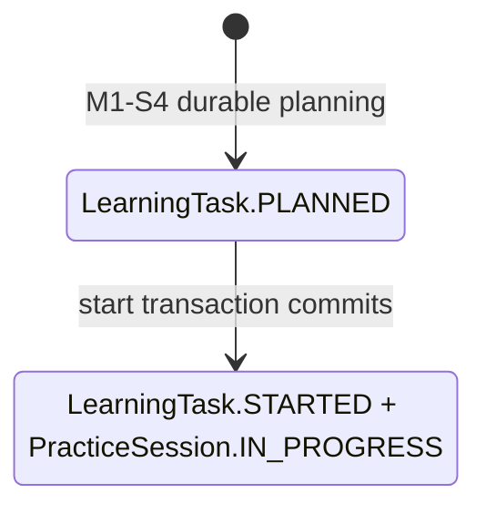

# PracticeSession Lifecycle Flow

- Document Status: `IMPLEMENTED`
- Feature / Slice: `M1-S5`
- Last Verified: `2026-09-04`
- Entry:
  - `POST /api/language-profiles/{languageProfileId}/learning-tasks/{taskId}/practice-sessions`
  - `PUT /api/language-profiles/{languageProfileId}/practice-sessions/{sessionId}/responses/{stepId}`

## 1. Behavior Boundary

本 Flow 描述已经实现的 owner-scoped Text Practice lifecycle：authenticated 用户可以把自己
`LanguageProfile` 下的 `PLANNED` LearningTask 原子启动为唯一 `PracticeSession`，并按 Task 锁定的
exact `materialId + publishedVersion` 提交 step response。Session 与 response 都通过
`Session → LearningTask` join 还原 owner/profile，不接受客户端提供的 user identity。

当前实现负责：

- `PLANNED` Task 与唯一 `IN_PROGRESS` Session 的原子创建；
- repeated / concurrent start 返回数据库中同一个 durable Session；
- 每个 `(sessionId, stepId)` 只接受首次 learner text，相同 exact payload 可幂等重放，不同 payload 冲突；
- learner text 原样保存，不 trim、不改大小写、不做 Unicode normalization；
- start 时只下发 learner 练习所需的安全 material projection。

明确不负责的行为：

- 不提供 Session complete / abandon API，也不把 LearningTask 推进到 `COMPLETED`；
- 不做 deterministic assessment、语义评分或答案判定；
- 不调用 LLM / Model Gateway，不生成 Evidence，不修改 Weakness、Level、Mastery 或 Learning Memory；
- 不保存 Prompt、Credential、accepted answers、semantic rubric 或 Content lineage；
- 不提供 response 修改、删除或覆盖语义。

## 2. Main Call Chain

### 2.1 Start PracticeSession

`tryStart` 与 Session insert 处于同一个 Spring transaction。Session insert、UNIQUE constraint 或 durable
reread 失败时，异常向上传播并回滚整个 transaction，Task 不会孤立停留在 `STARTED`。

### 2.2 Submit Learner Response

## 3. State and Authority

- `userId` 只来自 Spring Security 建立的 `UserContext`。客户端在 body、query 或 header 中提供的
  userId 不参与授权，API response 也不回传 userId。
- `languageProfileId` 是 language-specific learning workspace boundary。Session/response 的所有 read、lock
  与 mutation 都通过 `practice_session → learning_task` join 复核 trusted owner 与同一个 Profile；wrong-owner
  和 wrong-profile 均 fail closed。
- Task 锁定的 `(materialId, publishedVersion)` 是练习材料 identity。start 和 submit 都只解析 exact version，
  并复核 target/support language、difficulty、scenario 与 communication goal，不 fallback 到其他版本或语言。
- PostgreSQL 是 Session/response identity、status、timestamp、uniqueness 和 durable constraint authority：
  `UNIQUE(task_id)` 保证一个 Task 最多一个 Session，`PRIMARY KEY(session_id, step_id)` 保证一个 step
  只保存首次 response。
- response write 先锁定 owned Session row，再检查 `IN_PROGRESS` 并写入；数据库 insert gate 再次复核
  owner/profile/status，避免 terminal Session 接受迟到 response。
- learner text 是 private learning data，只能 owner-scoped 读取；HTTP success response 只返回
  `sessionId + stepId + submittedAt`，不回显 learner text。
- start 的 material projection 不包含 `acceptedAnswers`、`semanticRubricReference`、Content lineage 或 ownership
  identity。
- 本 Flow 不调用 LLM、不接触 Credential、不产生 Evaluation/Evidence，也不修改长期 Persistent Learner
  Model state；因此 material、database 或 infrastructure failure 不会污染 Weakness、Level、Mastery 或 Memory。

## 4. State Transition

M1-S5 当前只实现上述 transition。`PracticeSession.COMPLETED / ABANDONED` 是 V9 schema 与 Domain 中受约束的
lifecycle vocabulary，但本 slice 没有公开 transition；LearningTask 也不会在 response submission 时进入
`COMPLETED`。

## 5. Failure / Rejection Paths

### 5.1 Start

| 条件 | HTTP | code | Durable mutation |
|---|---:|---|---|
| unauthenticated | 401 | 既有 authentication contract | none |
| missing / invalid CSRF | 403 | 既有 CSRF contract | none |
| Task unknown / wrong owner / wrong profile | 404 | `LEARNING_TASK_NOT_FOUND` | none |
| existing owned Session | 200 | success replay | none |
| Task 非 `PLANNED` 且无 Session | 409 | `LEARNING_TASK_NOT_STARTABLE` | none |
| exact material missing / inconsistent | 503 | `PRACTICE_MATERIAL_UNAVAILABLE` | none |
| first valid start | 201 | success | Task `STARTED` + one `IN_PROGRESS` Session |
| concurrent valid start loser | 200 | success replay | winner mutation only |
| Session insert / durable reread / infrastructure failure | generic 5xx | sanitized framework response | transaction rollback |

### 5.2 Response

| 条件 | HTTP | code | Durable mutation |
|---|---:|---|---|
| unauthenticated | 401 | 既有 authentication contract | none |
| missing / invalid CSRF | 403 | 既有 CSRF contract | none |
| malformed JSON / wrong field type | 400 | framework-safe response | none |
| learnerText null、blank 或超过 2,000 Unicode code points | 400 | `INVALID_PRACTICE_RESPONSE` | none |
| Session unknown / wrong owner / wrong profile | 404 | `PRACTICE_SESSION_NOT_FOUND` | none |
| stepId 不属于 exact material | 404 | `PRACTICE_STEP_NOT_FOUND` | none |
| exact material missing / inconsistent | 503 | `PRACTICE_MATERIAL_UNAVAILABLE` | none |
| Session 已 terminal | 409 | `PRACTICE_SESSION_NOT_ACCEPTING_RESPONSES` | none |
| first valid payload | 201 | success | one exact response |
| same exact payload replay | 200 | success replay | none；返回首次 submittedAt |
| same step、different payload | 409 | `PRACTICE_RESPONSE_CONFLICT` | none；首次 response 不变 |
| unexpected database / infrastructure failure | generic 5xx | sanitized framework response | transaction rollback |

## 6. Verification Evidence

以下均为 2026-09-04 fresh 运行：

- `PracticeSessionTests`：8/8 PASS；覆盖 Session lifecycle timestamp invariants、response exact text、blank / null /
  2,000 code-point boundary 与 stepId identity。
- `PracticeSessionApplicationServiceTests`：21/21 PASS；覆盖 start/submit 调用顺序、atomic rollback contract、
  repeated/concurrent start、exact material guard、safe projection、Session row lock、replay/conflict 与失败路径零 mutation。
- `PracticeSessionControllerTests`：12/12 PASS；覆盖 authentication、CSRF、201/200/400/404/409/503 stable
  mapping、Location、trusted UserContext、safe response projection 与 sanitized unexpected failure。
- `MapperSqlSafetyTests`：2/2 PASS；覆盖 Mapper parameter binding、`FOR UPDATE OF session` 与
  `ON CONFLICT DO NOTHING`，无 `${...}` substitution。
- `PracticeSessionPersistenceIntegrationTests`（真实 PostgreSQL 18.6 + 真实 Built-in catalog + 真实 Repository）：
  19/19 PASS；覆盖 V9 constraints、UUIDv7、Task `STARTED` insert gate、owner/profile isolation、exact text、
  material/step guard、rollback、one-Session uniqueness，以及 concurrent start / same response replay /
  different response conflict。
- disposable PostgreSQL 18.6 empty schema：Flyway V1–V9 validated/applied 9/9，
  `flyway_schema_history` V1–V9 全部 `success=true`。
- 受影响回归：`LearningTaskPersistenceIntegrationTests` 10/10 PASS；
  `LearningTaskPlanningIntegrationTests` 7/7 PASS。
- wider server regression：501 tests / 0 failures / 0 errors / 119 DB 或 Redis environment-gated skips；
  其中本 Flow 的数据库 tests 已在上一项真实 PostgreSQL run 中单独 19/19 通过。
- disposable verification container 已删除；未修改 primary compose database。

## 7. Source References

- `server/src/main/java/com/dailylanguage/practice/api/PracticeSessionController.java`
- `server/src/main/java/com/dailylanguage/practice/application/PracticeSessionApplicationService.java`
- `server/src/main/java/com/dailylanguage/practice/domain/PracticeSession.java`
- `server/src/main/java/com/dailylanguage/practice/infrastructure/PracticeSessionRepository.java`
- `server/src/main/java/com/dailylanguage/practice/infrastructure/PracticeSessionMapper.java`
- `server/src/main/java/com/dailylanguage/planner/infrastructure/LearningTaskRepository.java`
- `server/src/main/java/com/dailylanguage/content/domain/LearningMaterialCatalog.java`
- `server/src/main/java/com/dailylanguage/content/infrastructure/BuiltInLearningMaterialCatalog.java`
- `server/src/main/resources/mapper/PracticeSessionMapper.xml`
- `server/src/main/resources/db/migration/V9__add_practice_session.sql`
- `server/src/test/java/com/dailylanguage/practice/domain/PracticeSessionTests.java`
- `server/src/test/java/com/dailylanguage/practice/application/PracticeSessionApplicationServiceTests.java`
- `server/src/test/java/com/dailylanguage/practice/api/PracticeSessionControllerTests.java`
- `server/src/test/java/com/dailylanguage/practice/infrastructure/PracticeSessionPersistenceIntegrationTests.java`
