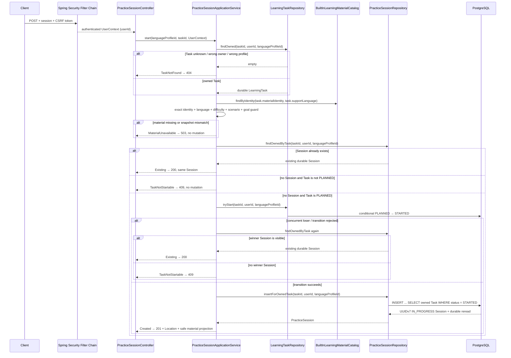
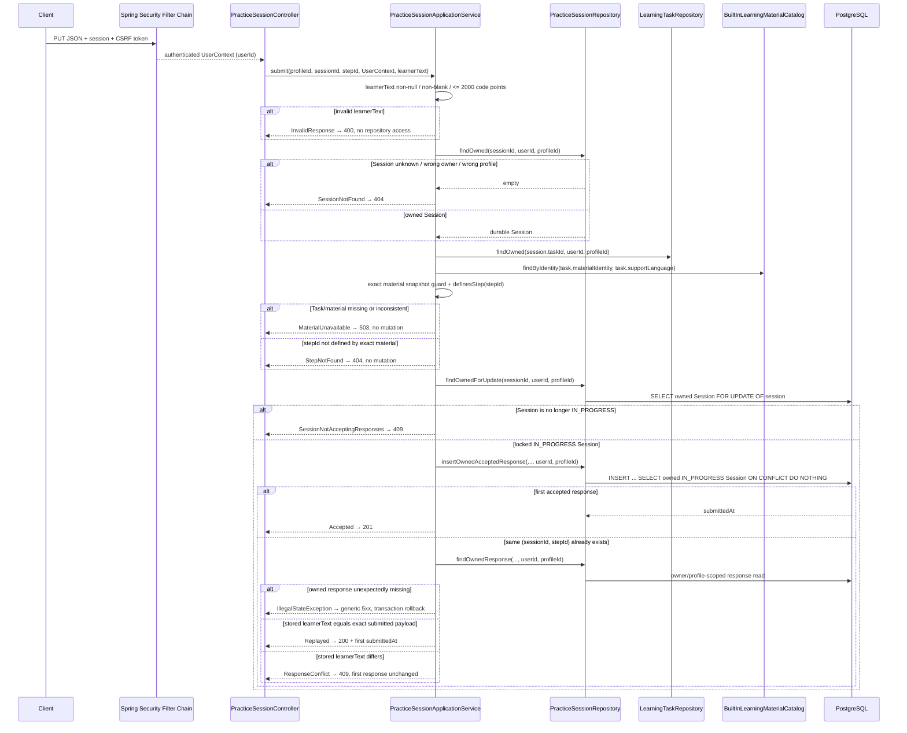
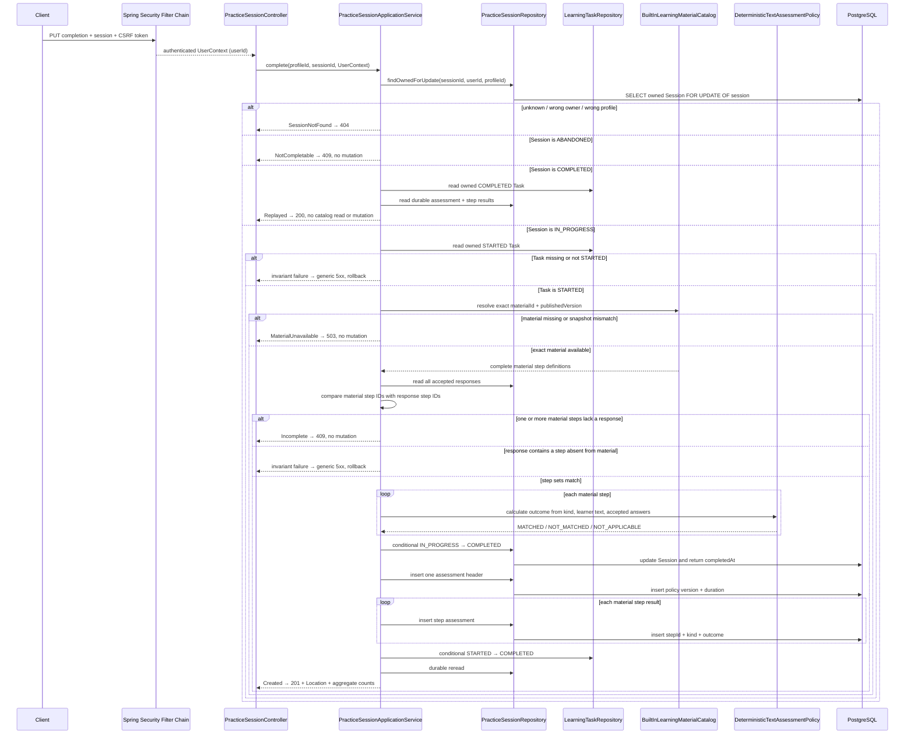
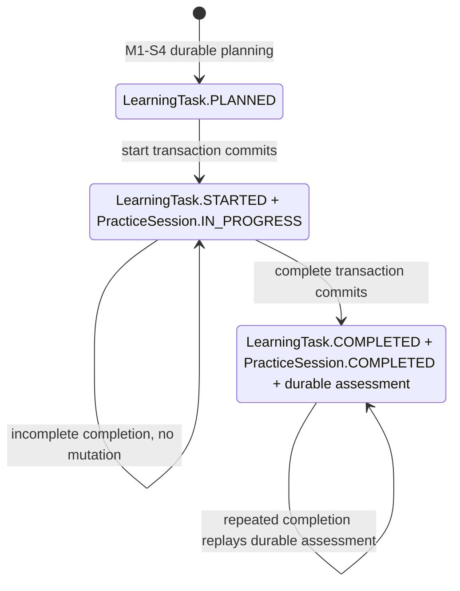

# PracticeSession Lifecycle Flow

- Document Status: `IMPLEMENTED`
- Feature / Slice: `M1-S5 / M1-S6`
- Last Verified: `2026-09-04`
- Entry:
  - `POST /api/language-profiles/{languageProfileId}/learning-tasks/{taskId}/practice-sessions`
  - `PUT /api/language-profiles/{languageProfileId}/practice-sessions/{sessionId}/responses/{stepId}`
  - `PUT /api/language-profiles/{languageProfileId}/practice-sessions/{sessionId}/completion`

## 1. Behavior Boundary

本 Flow 描述已经实现的 owner-scoped Text Practice lifecycle：authenticated 用户可以把自己
`LanguageProfile` 下的 `PLANNED` LearningTask 原子启动为唯一 `PracticeSession`，按 Task 锁定的
exact `materialId + publishedVersion` 为每个 material step 提交一条 response，并在全部 step 已回答后
原子完成 Session、保存 deterministic assessment、完成 LearningTask。Session、response 与 assessment
都通过 `Session → LearningTask` 链路还原 owner/profile，不接受客户端提供的 user identity。

当前实现负责：

- `PLANNED` Task 与唯一 `IN_PROGRESS` Session 的原子创建；
- repeated / concurrent start 返回数据库中同一个 durable Session；
- 每个 `(sessionId, stepId)` 只接受首次 learner text，相同 exact payload 可幂等重放，不同 payload 冲突；
- learner text 原样保存，不 trim、不改大小写、不做 Unicode normalization；
- start 时只下发 learner 练习所需的安全 material projection；
- completion 根据 Task 保存的 exact material identity 取得完整 step 定义，要求每个 material step 都已有 response；
- `EXACT` step 按 `strip → NFC → case-sensitive exact` 产生 `MATCHED / NOT_MATCHED`，`SEMANTIC_ONLY`
  只产生 `NOT_APPLICABLE`；
- Session `IN_PROGRESS → COMPLETED`、一条 assessment header、每个 step 的 assessment row 与 Task
  `STARTED → COMPLETED` 在同一个 transaction 内原子提交；
- repeated / concurrent completion 读取并返回同一个 durable assessment，不重新依赖 material catalog。

明确不负责的行为：

- 不提供 Session abandon API；
- 不做 semantic correctness、naturalness、pronunciation 或 LLM-based 评分；
- 不调用 LLM / Model Gateway，不生成 Evidence，不修改 Weakness、Level、Mastery 或 Learning Memory；
- 不保存 Prompt、Credential、accepted answers、semantic rubric 或 Content lineage；
- 不提供 response 修改、删除或覆盖语义。

## 2. Main Call Chain

### 2.1 Start PracticeSession

`tryStart` 与 Session insert 处于同一个 Spring transaction。Session insert、UNIQUE constraint 或 durable
reread 失败时，异常向上传播并回滚整个 transaction，Task 不会孤立停留在 `STARTED`。

### 2.2 Submit Learner Response

### 2.3 Complete PracticeSession

`complete` 的外层 Spring transaction 从取得 Session 行锁开始，直到方法正常返回后 commit 或异常后 rollback
才释放锁。response submission 与 completion 都使用 Session-row-first 锁序：并发 response 必须在锁释放后重新
观察 Session 状态，因此不能在 completion commit 后插入迟到 response；并发 completion 的后到请求会读取
`COMPLETED` Session，并重放已经持久化的 assessment。

一份 material 可以定义多个 `TextPracticeStep`；同一个 Session 对每个 step 最多保存一条
`practice_response`。completion 只创建一条 `deterministic_assessment` 作为 Session 级概要，并为每个 material
step 创建一条 `deterministic_step_assessment`。这些结果只表示本次练习的确定性观察，不表示用户已掌握，也不
进入长期学习状态。

## 3. State and Authority

- `userId` 只来自 Spring Security 建立的 `UserContext`。客户端在 body、query 或 header 中提供的
  userId 不参与授权，API response 也不回传 userId。
- `languageProfileId` 是 language-specific learning workspace boundary。Session、response 与 assessment 的所有
  read、lock 与 mutation 都通过 `practice_session → learning_task` 链路复核 trusted owner 与同一个 Profile；
  wrong-owner 和 wrong-profile 均 fail closed。
- Task 锁定的 `(materialId, publishedVersion)` 是练习材料 identity。start、submit 和首次 completion 都只解析 exact version，
  并复核 target/support language、difficulty、scenario 与 communication goal，不 fallback 到其他版本或语言。
- PostgreSQL 是 Session/response/assessment identity、status、timestamp、uniqueness 和 durable constraint authority：
  `UNIQUE(task_id)` 保证一个 Task 最多一个 Session，`PRIMARY KEY(session_id, step_id)` 保证一个 step
  只保存首次 response，`deterministic_assessment.session_id` 主键保证一个 Session 只有一个 assessment。
- response write 先锁定 owned Session row，再检查 `IN_PROGRESS` 并写入；数据库 insert gate 再次复核
  owner/profile/status，避免 terminal Session 接受迟到 response。
- learner text 是 private learning data，只能 owner-scoped 读取；HTTP success response 只返回
  `sessionId + stepId + submittedAt`，不回显 learner text。
- start 的 material projection 不包含 `acceptedAnswers`、`semanticRubricReference`、Content lineage 或 ownership
  identity。
- Java 持有 deterministic assessment authority：material 的 `TextPracticeStep.kind` 决定 `EXACT` 或
  `SEMANTIC_ONLY`；`M1_TEXT_EXACT_V1` 只做 outer strip、Unicode NFC 与 case-sensitive exact comparison。
  PostgreSQL CHECK 再约束 policy version 与 kind/outcome 合法组合。
- `COMPLETED` 表示练习流程已经完成，不表示答案全部正确或长期掌握。`NOT_MATCHED` 不阻止 Session 与 Task
  完成；`SEMANTIC_ONLY` 不伪造正确性，只保存 `NOT_APPLICABLE`。
- 本 Flow 不调用 LLM、不接触 Credential、不生成 Evidence，也不修改长期 Persistent Learner Model state；
  material、database 或 infrastructure failure 不会污染 Weakness、Level、Mastery 或 Memory。

## 4. State Transition

M1-S6 已公开 `IN_PROGRESS → COMPLETED` transition；`ABANDONED` 仍只是 V9 schema 与 Domain 中受约束的
lifecycle vocabulary，当前没有公开 transition。wrong answer 只改变 step outcome，不阻止完成；response submission
本身不改变 Session 或 Task 状态。

## 5. Failure / Rejection Paths

### 5.1 Start

| 条件 | HTTP | code | Durable mutation |
|---|---:|---|---|
| unauthenticated | 401 | 既有 authentication contract | none |
| missing / invalid CSRF | 403 | 既有 CSRF contract | none |
| Task unknown / wrong owner / wrong profile | 404 | `LEARNING_TASK_NOT_FOUND` | none |
| existing owned Session | 200 | success replay | none |
| Task 非 `PLANNED` 且无 Session | 409 | `LEARNING_TASK_NOT_STARTABLE` | none |
| exact material missing / inconsistent | 503 | `PRACTICE_MATERIAL_UNAVAILABLE` | none |
| first valid start | 201 | success | Task `STARTED` + one `IN_PROGRESS` Session |
| concurrent valid start loser | 200 | success replay | winner mutation only |
| Session insert / durable reread / infrastructure failure | generic 5xx | sanitized framework response | transaction rollback |

### 5.2 Response

| 条件 | HTTP | code | Durable mutation |
|---|---:|---|---|
| unauthenticated | 401 | 既有 authentication contract | none |
| missing / invalid CSRF | 403 | 既有 CSRF contract | none |
| malformed JSON / wrong field type | 400 | framework-safe response | none |
| learnerText null、blank 或超过 2,000 Unicode code points | 400 | `INVALID_PRACTICE_RESPONSE` | none |
| Session unknown / wrong owner / wrong profile | 404 | `PRACTICE_SESSION_NOT_FOUND` | none |
| stepId 不属于 exact material | 404 | `PRACTICE_STEP_NOT_FOUND` | none |
| exact material missing / inconsistent | 503 | `PRACTICE_MATERIAL_UNAVAILABLE` | none |
| Session 已 terminal | 409 | `PRACTICE_SESSION_NOT_ACCEPTING_RESPONSES` | none |
| first valid payload | 201 | success | one exact response |
| same exact payload replay | 200 | success replay | none；返回首次 submittedAt |
| same step、different payload | 409 | `PRACTICE_RESPONSE_CONFLICT` | none；首次 response 不变 |
| unexpected database / infrastructure failure | generic 5xx | sanitized framework response | transaction rollback |

### 5.3 Completion

| 条件 | HTTP | code | Durable mutation |
|---|---:|---|---|
| unauthenticated | 401 | 既有 authentication contract | none |
| missing / invalid CSRF | 403 | 既有 CSRF contract | none |
| Session unknown / wrong owner / wrong profile | 404 | `PRACTICE_SESSION_NOT_FOUND` | none |
| exact material missing / inconsistent | 503 | `PRACTICE_MATERIAL_UNAVAILABLE` | none |
| material step 缺少 response | 409 | `PRACTICE_SESSION_INCOMPLETE` | none |
| Session 已 `ABANDONED` | 409 | `PRACTICE_SESSION_NOT_COMPLETABLE` | none |
| Session 已 `COMPLETED` 且 durable state 完整 | 200 | success replay | none；不重新读取 catalog |
| 首次合法 completion | 201 | success | Session + assessment + step results + Task 原子提交 |
| wrong answer | 201 | success | step outcome=`NOT_MATCHED`；Session/Task 仍完成 |
| material 未定义的 durable response step 或 terminal state 不一致 | generic 5xx | sanitized framework response | transaction rollback |
| assessment / step insert、Task transition 或 durable reread 失败 | generic 5xx | sanitized framework response | transaction rollback；不留下部分完成状态 |

## 6. Verification Evidence

以下均为 2026-09-04 fresh 运行：

- `DeterministicAssessmentTests`：7/7 PASS；`MapperSqlSafetyTests`：2/2 PASS，覆盖 Java/数据库枚举约束、
  `duration_seconds BIGINT` binding 与参数化 SQL 安全边界。
- PostgreSQL targeted integration：`PracticeSessionPersistenceIntegrationTests` 30/30、
  `LearningTaskPersistenceIntegrationTests` 10/10、`LearningTaskPlanningIntegrationTests` 7/7，共 47/47 PASS；
  覆盖 S5 start/response 回归，以及 S6 owner/profile gate、response 完整性、wrong answer、assessment 原子持久化、
  rollback、durable replay、并发 completion 与 response/completion race。
- 现有 `daily-language-postgres-1` 使用 PostgreSQL 18.6；Flyway 先 validate 10 个 migrations，再从 V7 顺序应用
  V8、V9、V10，`flyway_schema_history` V1–V10 全部 `success=true`。实际 schema 已确认
  `duration_seconds BIGINT`，assessment/step-assessment 的 PK、FK 与 CHECK constraints 均生效。
- wider server regression：564 tests / 0 failures / 0 errors / 11 Redis 或 Redis+login environment-gated skips；
  其中 553 tests 实际执行并通过。
- `git diff --check` PASS。验证未下载 image、未创建或启动额外容器，只使用已有 compose PostgreSQL。
  integration tests 在当前数据库保留 8 条 assessment 与 12 条 step-assessment fixture，未擅自清理。

## 7. Source References

- `server/src/main/java/com/dailylanguage/practice/api/PracticeSessionController.java`
- `server/src/main/java/com/dailylanguage/practice/application/PracticeSessionApplicationService.java`
- `server/src/main/java/com/dailylanguage/practice/domain/DeterministicAssessment.java`
- `server/src/main/java/com/dailylanguage/practice/domain/DeterministicTextAssessmentPolicy.java`
- `server/src/main/java/com/dailylanguage/practice/domain/PracticeSession.java`
- `server/src/main/java/com/dailylanguage/practice/infrastructure/PracticeSessionRepository.java`
- `server/src/main/java/com/dailylanguage/practice/infrastructure/PracticeSessionMapper.java`
- `server/src/main/java/com/dailylanguage/planner/infrastructure/LearningTaskRepository.java`
- `server/src/main/java/com/dailylanguage/content/domain/LearningMaterialCatalog.java`
- `server/src/main/java/com/dailylanguage/content/domain/TextPracticeStep.java`
- `server/src/main/java/com/dailylanguage/content/infrastructure/BuiltInLearningMaterialCatalog.java`
- `server/src/main/resources/mapper/PracticeSessionMapper.xml`
- `server/src/main/resources/db/migration/V9__add_practice_session.sql`
- `server/src/main/resources/db/migration/V10__add_deterministic_assessment.sql`
- `server/src/test/java/com/dailylanguage/practice/domain/DeterministicAssessmentTests.java`
- `server/src/test/java/com/dailylanguage/practice/domain/DeterministicTextAssessmentPolicyTests.java`
- `server/src/test/java/com/dailylanguage/practice/domain/PracticeSessionTests.java`
- `server/src/test/java/com/dailylanguage/practice/application/PracticeSessionApplicationServiceTests.java`
- `server/src/test/java/com/dailylanguage/practice/api/PracticeSessionControllerTests.java`
- `server/src/test/java/com/dailylanguage/practice/infrastructure/PracticeSessionPersistenceIntegrationTests.java`
