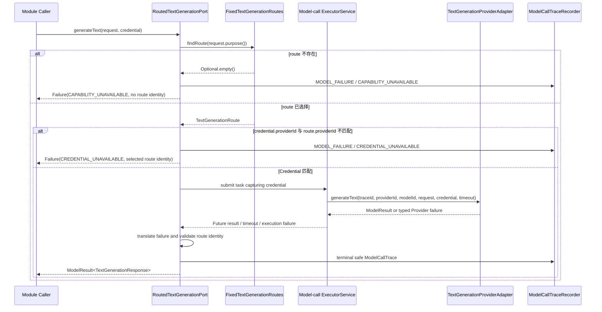

# Text Generation Credential Propagation Flow

- Document Status: `IMPLEMENTED`
- Feature / Slice: `M0-S7A / M0-S8C / M0-S8D`
- Last Verified: `2026-09-01`
- Entry: `TextGenerationPort.generateText(request, credential)`

## 1. Behavior Boundary

本 Flow 只描述 Model Gateway Module 内已经实现的 transient Credential propagation：调用方把一个
Provider-scoped Credential 与 provider-neutral `TextGenerationRequest` 分开传入，Gateway 选择 fixed route、
验证 Provider identity，并通过 model-call `ExecutorService` 显式传给 operation-specific Adapter。

Gateway 的最终 `ModelResult<TextGenerationResponse>` 会在返回调用方前形成一次安全的 terminal
`ModelCallTrace`，默认写入 INFO log。S8D 将同一个 Trace ID 显式传入 Executor task 与 Adapter，用于关联安全的
Provider diagnostics。当前 Flow 不包含 Browser / HTTPS Credential ingress、Application Workflow、Trace persistence
或 `ModelCallJob`，因此不是 BYOK End-to-End behavior。

## 2. Main Call Chain

## 3. State and Authority

- `TextGenerationRequest` 不保存 Provider、Model 或 Credential。
- `TransientProviderCredential` 只保存当前调用的 `ProviderId` 与 opaque secret；`toString()` 始终 redacted。
- Gateway 只校验 Credential 是否属于 selected Provider，不持久化、不缓存，也不把 secret 放入 result / failure。
- Adapter 是唯一允许读取 `credential.secret()` 的边界，且只应用于构造当前外部请求。
- `ModelCallTrace` 只保存 purpose、可用的 route identity、latency、status、typed failure、normalized finish
  reason 与 portable usage；默认 recorder 只把这些 metadata 写入 INFO log。
- Trace ID 通过 lambda parameter 显式跨越 caller / worker boundary；不使用 ThreadLocal、MDC 或 AOP，也不携带
  Credential、Prompt 或 generated text。
- 当前行为不读取或修改 PostgreSQL、Redis、Session、Language Profile 或任何 Learning State。

timeout 后的 `future.cancel(true)` 仍是 best effort。它不证明 worker 已停止，也不保证 Credential 立即从
JVM heap 消失；Gateway 不把 Credential 写入 durable state、Trace、Log、Gateway exception message 或
`ModelFailure`。concrete Adapter 同样必须遵守该 secret boundary。

## 4. State Transition

本 Flow 没有持久化状态机。Credential 只沿当前 method invocation 与其 submitted worker task 传播。

## 5. Failure / Rejection Paths

- 无 route：返回 identity-free `CAPABILITY_UNAVAILABLE`，不提交 Adapter task。
- Credential Provider mismatch：返回带 selected route identity 的 `CREDENTIAL_UNAVAILABLE`，不提交 Adapter task。
- Provider 实际拒绝 Credential：Adapter 使用 typed `AUTHENTICATION_FAILED`，Gateway 安全归一化。
- final deadline：best-effort cancel，并返回 route-aware `TIMEOUT`。
- unclassified exception、executor rejection、null result 或 route identity mismatch：记录不携带 secret 的
  `INTERNAL_FAILURE`，然后保持原有 fail-fast contract。
- recorder 的 runtime failure 只写安全 WARN，不能替换原 `ModelResult` 或异常。

## 6. Verification Evidence

- `TransientProviderCredentialTests.preservesTheOpaqueSecretWithoutExposingItThroughToString`
- `TransientProviderCredentialTests.rejectsMissingOrBlankCredentialPartsWithoutEchoingTheSecret`
- `RoutedTextGenerationPortTests.propagatesTheMatchingCredentialToTheAdapterWorkerExactlyOnce`
- `RoutedTextGenerationPortTests.returnsCredentialUnavailableWithoutSubmittingAMismatchedCredential`
- `RoutedTextGenerationPortTests.hidesAnUnclassifiedRuntimeExceptionMessageAndCause`
- `ModelCallTraceRuntimeTests`: success、pre-route failure、internal failure 与 recorder fail-open；
- `LoggingModelCallTraceRecorderTests`: INFO metadata 与 Credential / Prompt / generated text non-disclosure；
- `ModelCallTraceRuntimeTests.recordsSafeSuccessMetadataWithoutChangingTheModelResult`: worker 与 terminal Trace 使用
  同一个 UUID；
- S8D targeted tests: `44/44 PASS`；Model Gateway regression: `95/95 PASS`；server compile: PASS；
- latest wider server regression remains S7D evidence: `217 total / 0 failures / 0 errors / 33 environment-skipped`。

## 7. Source References

- `server/src/main/java/com/dailylanguage/modelgateway/credential/TransientProviderCredential.java`
- `server/src/main/java/com/dailylanguage/modelgateway/text/TextGenerationPort.java`
- `server/src/main/java/com/dailylanguage/modelgateway/text/execution/RoutedTextGenerationPort.java`
- `server/src/main/java/com/dailylanguage/modelgateway/text/execution/TextGenerationProviderAdapter.java`
- `server/src/main/java/com/dailylanguage/modelgateway/result/ModelFailureKind.java`
- `server/src/main/java/com/dailylanguage/modelgateway/trace/ModelCallTrace.java`
- `server/src/main/java/com/dailylanguage/modelgateway/trace/ModelCallTraceRecorder.java`
- `server/src/main/java/com/dailylanguage/modelgateway/trace/LoggingModelCallTraceRecorder.java`
- `server/src/test/java/com/dailylanguage/modelgateway/trace/`
