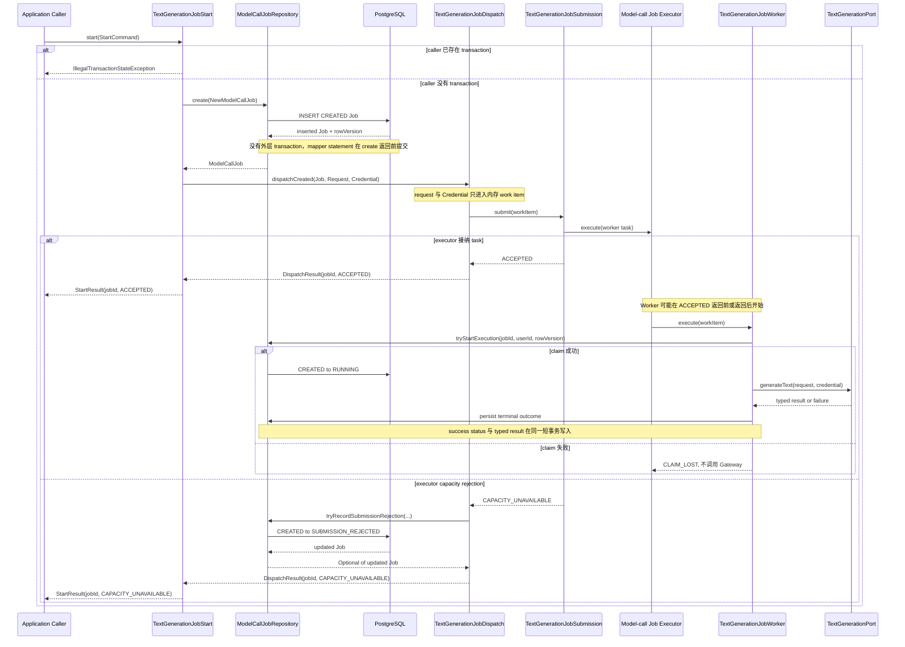
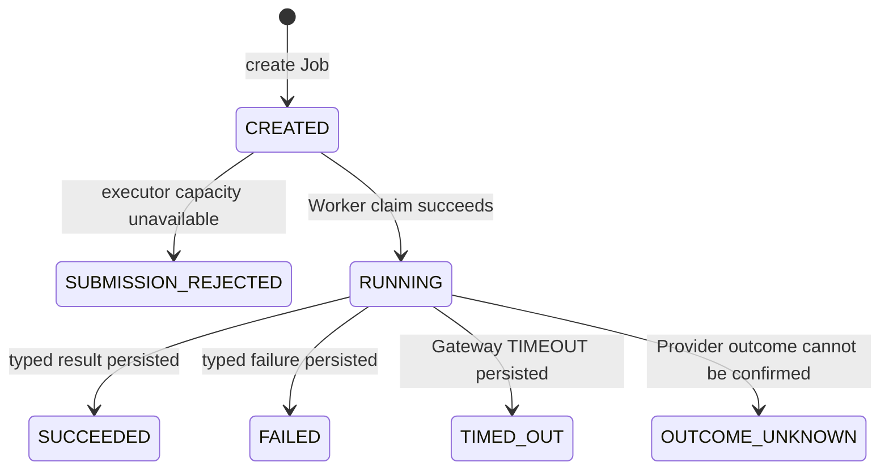

# Text Generation Job Start Flow

- Document Status: `IMPLEMENTED`
- Feature / Slice: `M0-S9K1 / M0-S9K2 / M0-S9K3 / M1-S8D`
- Last Verified: `2026-09-08`
- Entry: `TextGenerationJobStart.start(command)`；`TextGenerationJobDispatch.dispatchCreated(command)`

## 1. Behavior Boundary

本 Flow 描述已经实现的 Text Generation Job 启动与既有 Job dispatch 链路：Application caller 提供 owner、
Workflow identity、provider-neutral request 与 transient Credential；`TextGenerationJobStart` 先创建 PostgreSQL Job，
再委托 `TextGenerationJobDispatch` 构造只存在于内存的 work item。M1-S8D 的 Evaluator 已由 S8B 原子创建
Run/Job，因此直接调用同一 `TextGenerationJobDispatch`，不创建第二个 Job。该组件通过
`TextGenerationJobSubmission` 交给独立 Job Executor，最终由
`TextGenerationJobWorker` claim Job、调用 `TextGenerationPort` 并持久化结果。

Evaluator 已在 M1-S8D 接入；Planner、Conversation 与 HTTP API 尚未接入。该链路不实现 interactive wait、
polling、用户确认、durable queue、automatic retry 或 CREATED Job reconciliation。

## 2. Main Call Chain

`TextGenerationJobStart.start` 与 `TextGenerationJobDispatch.dispatchCreated` 都使用
`@Transactional(propagation = NEVER)`。它们拒绝已有调用方事务，使 Job INSERT 在 submission 前完成提交，
避免异步 Worker 使用另一个数据库连接时看不到尚未提交的 Job。S8D Evaluator 的 S8B Run/Job creation 使用
`REQUIRES_NEW`，返回后再进入 dispatch，因此遵守同一可见性约束。

## 3. State and Authority

- PostgreSQL 是 Job execution status、result 与 `rowVersion` 的 authority。
- `create` 持久化 owner `userId`、optional `languageProfileId`、Workflow identity/version、purpose、operation 与
  expiry；初始 execution status 为 `CREATED`、consumption status 为 `NOT_READY`、`rowVersion = 0`。
- Provider route 尚未选择时，Job 的 `providerId` 与 `modelId` 同时为空；最终 route 由 Gateway result/failure
  带回并由 terminal transition 保存。
- Worker 使用 `jobId + userId + expected rowVersion + CREATED` conditional update 取得 execution right；claim
  成功后才允许调用 Gateway。
- `TextGenerationRequest` 和 `TransientProviderCredential` 只在 `StartCommand`、`TextGenerationJobWorkItem` 与当前
  Worker 调用链中传播。Credential 不进入 `NewModelCallJob`、PostgreSQL、Redis、Trace、Log 或 durable payload。
- Job lifecycle 不修改 Weakness、Level、Mastery 或其他 Persistent Learner State。

## 4. State Transition

每次合法 transition 都通过 owner、当前 status 与 expected `rowVersion` 约束；成功更新时 `rowVersion + 1`。
Execution status 与 consumption status 保持分离，本 Flow 不执行 result consumption。

## 5. Failure / Rejection Paths

- 调用方存在 transaction：Spring 在进入方法体前抛出 `IllegalTransactionStateException`，不创建或提交任务。
- Job create 失败：异常向上传播，不调用 Submission。
- executor capacity rejection：Provider 没有被调用；只有 `CREATED → SUBMISSION_REJECTED` 成功持久化后，入口
  才返回 `CAPACITY_UNAVAILABLE`。
- submission rejection transition 返回 empty：入口抛出固定、安全的 `IllegalStateException`，不把未确认状态
  报告为已完成。
- submission 抛出非 capacity `RuntimeException`：异常原样向上传播，不执行 rejection compensation，因为入口
  无法安全判断 executor 是否已经接纳 task；Job 可能停留在 `CREATED`，也可能已经被 Worker claim。
- Job commit 后、submission 前进程终止：Job 会停留在 `CREATED`。当前没有 durable dispatcher、outbox 或
  reconciliation，不自动 retry。
- Worker claim 返回 empty：Worker 返回 `CLAIM_LOST`，不调用 Gateway，也不继续写 terminal status。
- Provider call 已开始后的异常不能证明 Provider 未执行；Worker 按既有规则记录 `OUTCOME_UNKNOWN` 或报告 terminal
  write lost，不自动再次调用 Provider。

## 6. Verification Evidence

- `TextGenerationJobStartTests`: create-before-dispatch、create failure 与 dispatch failure propagation；
- `TextGenerationJobDispatchTests`: memory-only work item、capacity rejection CAS、unknown failure、state/purpose gate；
- `TextGenerationJobDispatchTransactionTests.activeCallerTransactionIsRejectedBeforeSubmission`
- `TextGenerationJobStartTransactionTests.startsWithoutOpeningATransaction`
- `TextGenerationJobStartTransactionTests.activeCallerTransactionIsRejectedBeforeJobCreation`
- `TextGenerationJobSubmissionTests`: accepted 与 capacity rejection boundary；
- `TextGenerationJobWorkerTests`: claim、known outcome、outcome unknown 与 terminal write race；
- `ModelCallJobSubmissionRejectionRepositoryIntegrationTests`: owner、status 与 rowVersion conditional transition；
- S9K3 targeted tests: `7/7 PASS`；Spring context smoke: `2/2 PASS`；
- fresh PostgreSQL 18.6 + Flyway V1–V7 ModelCallJob regression: `103/103 PASS`。
- M1-S8D fresh targeted unit/config regression：29/29 PASS；disposable PostgreSQL 18.6 empty schema Flyway
  V1–V12 12/12，Evaluation dispatch integration 1/1 PASS；full server regression 700 tests / 0 failures /
  0 errors / 159 environment-conditional skips。

## 7. Source References

- `server/src/main/java/com/dailylanguage/modelcalljob/application/TextGenerationJobStart.java`
- `server/src/main/java/com/dailylanguage/modelcalljob/application/TextGenerationJobDispatch.java`
- `server/src/main/java/com/dailylanguage/modelcalljob/application/TextGenerationJobSubmission.java`
- `server/src/main/java/com/dailylanguage/modelcalljob/application/TextGenerationJobWorkItem.java`
- `server/src/main/java/com/dailylanguage/modelcalljob/application/TextGenerationJobWorker.java`
- `server/src/main/java/com/dailylanguage/modelcalljob/infrastructure/ModelCallJobRepository.java`
- `server/src/main/resources/mapper/ModelCallJobMapper.xml`
- `server/src/test/java/com/dailylanguage/modelcalljob/application/`
- `server/src/test/java/com/dailylanguage/modelcalljob/infrastructure/ModelCallJobSubmissionRejectionRepositoryIntegrationTests.java`
