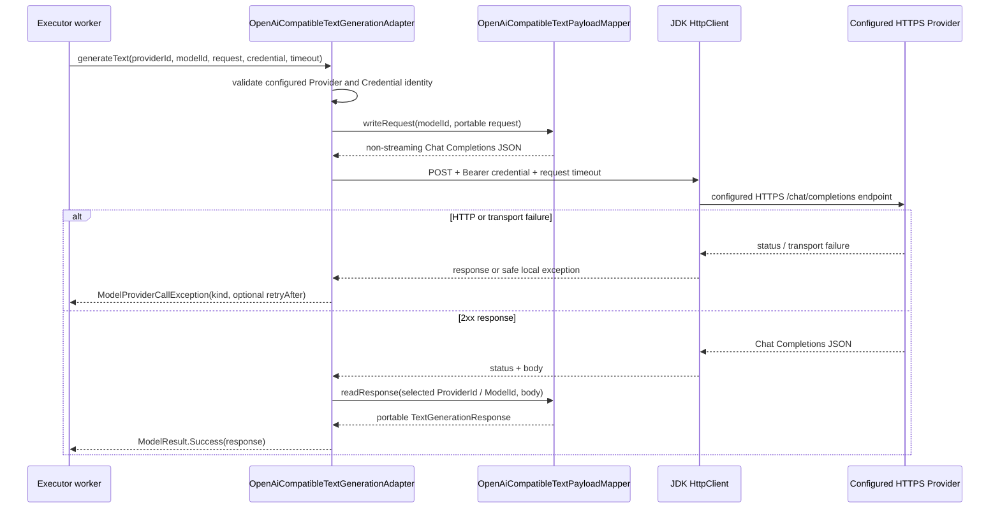

# OpenAI-compatible Text Provider Call Flow

- Document Status: `IMPLEMENTED`
- Feature / Slice: `M0-S7B`
- Last Verified: `2026-08-30`
- Entry: `OpenAiCompatibleTextGenerationAdapter.generateText(...)`

## 1. Behavior Boundary

本 Flow 描述已经实现的 concrete Provider protocol boundary：一个已经由 fixed route 选中的
OpenAI-compatible Text Adapter 使用 matching transient Credential 发起 non-streaming Chat Completions HTTP
request，并把安全、portable 的结果或 typed failure 返回 Gateway。

第一个配置目标是 DeepSeek。当前没有 Spring runtime wiring、Browser / HTTPS Credential ingress、
Application Workflow 或 live DeepSeek network verification，因此本 Flow 不是 BYOK End-to-End behavior。

## 2. Main Call Chain

## 3. State and Authority

- `OpenAiCompatibleProviderConfig` owns the trusted ProviderId and HTTPS endpoint value；
- `TextGenerationRoute` remains the selected ModelId authority；Provider raw `model` does not replace it；
- `TransientProviderCredential.secret()` is read only to build the outbound Bearer header；
- Adapter and mapper do not write PostgreSQL, Redis, Trace, logs, or Learning State；
- the injected `HttpClient` must use `Redirect.NEVER`, so Credential is not forwarded by redirect.

## 4. Failure / Rejection Paths

- configured Provider / Credential identity mismatch: fail fast before HTTP；
- unsafe header value: `AUTHENTICATION_FAILED` without message or cause；
- 401 / 403: `AUTHENTICATION_FAILED`；408 or client timeout: `TIMEOUT`；
- 429: `RATE_LIMITED`；5xx / transport unavailable: `TEMPORARY_UNAVAILABLE`；
- other 4xx: `REQUEST_REJECTED`；unclassified status or malformed 2xx payload: `PROVIDER_FAILURE`；
- positive numeric `Retry-After` is retained only for rate limit / temporary unavailable；invalid raw value is dropped；
- Provider error body, raw response, Prompt, Credential, transport / parsing message and cause do not cross the Adapter.

## 5. Verification Evidence

- `OpenAiCompatibleProviderConfigTests`: trusted DeepSeek HTTPS endpoint and invalid endpoint rejection；
- `OpenAiCompatibleTextPayloadMapperTests`: role/request mapping, selected route identity, finish reason, usage and
  malformed payload safety；
- `OpenAiCompatibleTextGenerationAdapterTests`: Bearer header, timeout, redirect rejection, HTTP / transport failure,
  Retry-After, interrupt restoration and secret-safe failure；
- focused tests: 18/18 PASS；Model Gateway regression: 61/61 PASS；
- server regression: 201 total / 0 failures / 0 errors / 33 environment-skipped.

## 6. Source References

- `server/src/main/java/com/dailylanguage/modelgateway/text/openaicompatible/OpenAiCompatibleProviderConfig.java`
- `server/src/main/java/com/dailylanguage/modelgateway/text/openaicompatible/OpenAiCompatibleTextGenerationAdapter.java`
- `server/src/main/java/com/dailylanguage/modelgateway/text/openaicompatible/OpenAiCompatibleTextPayloadMapper.java`
- `server/src/test/java/com/dailylanguage/modelgateway/text/openaicompatible/`
