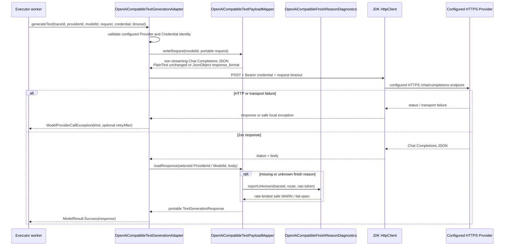

# OpenAI-compatible Text Provider Call Flow

- Document Status: `IMPLEMENTED`
- Feature / Slice: `M0-S7B / M0-S7C / M0-S8A / M0-S8D`
- Last Verified: `2026-09-01`
- Entry: `OpenAiCompatibleTextGenerationAdapter.generateText(...)`

## 1. Behavior Boundary

本 Flow 描述已经实现的 concrete Provider protocol boundary：一个已经由 fixed route 选中的
OpenAI-compatible Text Adapter 使用 matching transient Credential 发起 non-streaming Chat Completions HTTP
request，并把安全、portable 的结果或 typed failure 返回 Gateway。

S8A 增加了 provider-neutral JSON Object request contract：`PlainText` payload 保持原样，
`JsonObject` 才映射为 OpenAI-compatible `response_format.type=json_object`。当前不解析或验证
Provider 返回的 JSON content，因此不是 Structured Output validation End-to-End evidence。

S8D 对缺失或陌生的 Provider raw finish reason 保持 portable `UNKNOWN`，并使用同一 Model-call Trace ID 输出
rate-limited safe WARN。raw reason 不进入 portable response、terminal Trace、metric 或 persistence。

第一个配置目标是 DeepSeek。S7C 已增加 Spring runtime wiring，S7D 已增加 authenticated Backend Credential
API ingress；当前仍没有 Hosted TLS verification、Browser local/session storage UI、业务 Agent Workflow 或 live DeepSeek network
verification，因此本 Flow 仍不是完整产品 BYOK End-to-End evidence。

## 2. Runtime Composition

`application.yml` 显式导入 `model-gateway.yml`，`TextGenerationGatewayConfiguration` 在 startup 使用其中的
typed deployment properties 组成一套 runtime：默认 route 包含 `CONNECTION_VERIFICATION` 与 `CONVERSATION`，
均指向 `deepseek / deepseek-v4-flash / 30s`，并注入同一个 OpenAI-compatible Adapter、禁止 redirect
的 JDK HttpClient，以及独立 bounded model-call ExecutorService（默认 4 workers / 16 queue）。这一过程不读取
Credential，也不发起网络请求；切换到 OpenAI 只替换 ProviderId、endpoint 与 ModelId 配置。

## 3. Main Call Chain

## 4. State and Authority

- `OpenAiCompatibleProviderConfig` owns the trusted ProviderId and HTTPS endpoint value；
- `TextGenerationRoute` remains the selected ModelId authority；Provider raw `model` does not replace it；
- `TextOutputSpecification` owns the portable PlainText / JsonObject request choice；JsonObject 不允许覆盖
  Provider、Model、endpoint 或任意 Provider option；
- `TransientProviderCredential.secret()` is read only to build the outbound Bearer header；
- known finish reason 不记录 raw value；unknown safe token 限定为 `[A-Za-z0-9._-]{1,64}`，非法或超长值只记录
  UTF-16 length 与 SHA-256 digest；每个 Provider / Model 一分钟最多一条 WARN；
- diagnostics 使用代码版本 `openai-compatible-text-v1` 与当前 Trace ID，且自身失败不能改变 `UNKNOWN` response；
- Adapter、mapper 与 diagnostics 不写 PostgreSQL、Redis、Trace 或 Learning State；diagnostics 是当前唯一允许
  记录 raw finish reason 派生信息的边界，并受 allowlist、redaction 与 per-route rate limit 约束；
- the injected `HttpClient` must use `Redirect.NEVER`, so Credential is not forwarded by redirect.

## 5. Failure / Rejection Paths

- configured Provider / Credential identity mismatch: fail fast before HTTP；
- unsafe header value: `AUTHENTICATION_FAILED` without message or cause；
- 401 / 403: `AUTHENTICATION_FAILED`；408 or client timeout: `TIMEOUT`；
- 429: `RATE_LIMITED`；5xx / transport unavailable: `TEMPORARY_UNAVAILABLE`；
- other 4xx: `REQUEST_REJECTED`；unclassified status or malformed 2xx payload: `PROVIDER_FAILURE`；
- positive numeric `Retry-After` is retained only for rate limit / temporary unavailable；invalid raw value is dropped；
- missing or unknown finish reason: response remains `UNKNOWN`；diagnostics failure is swallowed and does not replace it；
- Provider error body, raw response, Prompt, Credential, transport / parsing message and cause do not cross the Adapter.

## 6. Verification Evidence

- `OpenAiCompatibleProviderConfigTests`: trusted DeepSeek HTTPS endpoint and invalid endpoint rejection；
- `TextGenerationRequestTests` / `OpenAiCompatibleTextPayloadMapperTests`: provider-neutral JsonObject specification、
  PlainText payload regression、JsonObject response-format mapping、role/request mapping、selected route identity、
  finish reason、usage and malformed payload safety；
- `OpenAiCompatibleTextGenerationAdapterTests`: Bearer header, timeout, redirect rejection, HTTP / transport failure,
  Retry-After, interrupt restoration and secret-safe failure；
- `OpenAiCompatibleFinishReasonDiagnosticsTests`: known-value silence、safe / invalid classification、invalid raw
  non-disclosure、per-route one-minute rate limit、concurrent suppression 与 fail-open；
- `TextGenerationGatewayConfigurationTests`: imported configuration resource、default DeepSeek binding、OpenAI
  override、bounded executor 与 invalid configuration；
- S8A focused tests: 11/11 PASS；Model Gateway regression: 79/79 PASS；server compile: PASS；
- S8D targeted tests: 44/44 PASS；Model Gateway regression: 95/95 PASS；server compile: PASS；
- latest wider server regression remains the S7D evidence: 217 total / 0 failures / 0 errors / 33 environment-skipped；
  S8D 未重跑 full server suite。

## 7. Source References

- `server/src/main/java/com/dailylanguage/modelgateway/text/openaicompatible/OpenAiCompatibleProviderConfig.java`
- `server/src/main/java/com/dailylanguage/modelgateway/text/openaicompatible/OpenAiCompatibleTextGenerationAdapter.java`
- `server/src/main/java/com/dailylanguage/modelgateway/text/openaicompatible/OpenAiCompatibleTextPayloadMapper.java`
- `server/src/main/java/com/dailylanguage/modelgateway/text/openaicompatible/OpenAiCompatibleFinishReasonDiagnostics.java`
- `server/src/main/java/com/dailylanguage/modelgateway/infrastructure/TextGenerationGatewayProperties.java`
- `server/src/main/java/com/dailylanguage/modelgateway/infrastructure/TextGenerationGatewayConfiguration.java`
- `server/src/main/resources/application.yml`
- `server/src/main/resources/model-gateway.yml`
- `server/src/test/java/com/dailylanguage/modelgateway/text/openaicompatible/`
- `server/src/test/java/com/dailylanguage/modelgateway/infrastructure/TextGenerationGatewayConfigurationTests.java`
