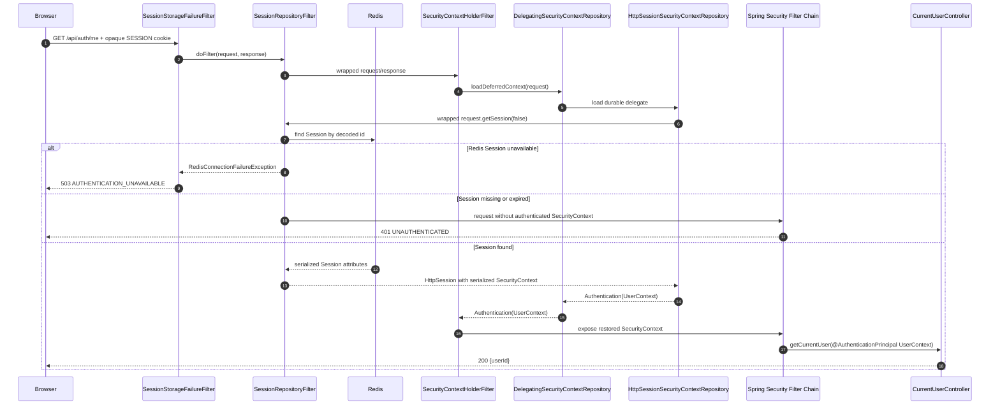

# User Login and Session Flow

- Document Status: `IMPLEMENTED`
- Feature / Slice: `M0-S4C1 / M0-S4C2 / M0-S4D`
- Last Verified: `2026-08-31`
- Entry: `POST /api/auth/login`; authenticated restore check: `GET /api/auth/me`

## 1. Behavior Boundary

本 Flow 描述已经实现的 LOCAL_EMAIL login、Redis-backed Session 建立、后续请求恢复和当前
Session 失效过程。Hosted / public-registration mode 下，客户端提交 form-urlencoded email / password；
成功结果是 `204 No Content`、opaque `SESSION` cookie，以及 Redis Session 中只包含可信
`SecurityContext(UserContext(userId))` 的认证状态。

`REGISTRATION_ENABLED=false` 的 singleton mode 不执行 password login：有效 CSRF 请求由
`SingleUserAuthenticationFilter` 在 Rate Limit 和 Argon2 前返回 `404`。该模式通过
`PersistentSingleUser` 为普通受保护请求建立同一类型的 `UserContext`，但不创建 login Session。

本 Flow 不负责注册账号、Account Linking、external Provider login、remember-me、完整前端页面或任何
Learning State 变更。login 只建立 request identity，不创建或选择 `LanguageProfile`。

## 2. Main Call Chain

### 2.1 Login and Session creation

```mermaid
sequenceDiagram
    autonumber
    participant Browser
    participant FailureFilter as SessionStorageFailureFilter
    participant SessionFilter as SessionRepositoryFilter
    participant CSRF as CsrfFilter
    participant SingleUser as SingleUserAuthenticationFilter
    participant Limit as LoginRateLimitFilter
    participant LoginFilter as UsernamePasswordAuthenticationFilter
    participant ProviderManager
    participant Provider as LocalPasswordAuthenticationProvider
    participant AccountRepo as LocalAuthenticationRepository
    participant PostgreSQL
    participant Hasher as LocalPasswordHasher
    participant SessionStrategy as ChangeSessionIdAuthenticationStrategy
    participant ContextRepo as DelegatingSecurityContextRepository
    participant HttpSessionRepo as HttpSessionSecurityContextRepository
    participant Redis

    Browser->>FailureFilter: POST /api/auth/login + CSRF + email/password
    FailureFilter->>SessionFilter: doFilter(request, response)
    SessionFilter->>Redis: resolve opaque SESSION id and load existing Session if present
    SessionFilter->>CSRF: wrapped request/response
    CSRF->>CSRF: validate XSRF-TOKEN cookie/header
    alt CSRF missing or mismatched
        CSRF-->>Browser: 403
    else valid CSRF
        CSRF->>SingleUser: continue filter chain
        alt singleton User exists
            SingleUser-->>Browser: 404; stop before Rate Limit and Argon2
        else Hosted/public login path
            SingleUser->>Limit: continue filter chain
            Limit->>Redis: record hashed client-address and normalized-email buckets
            alt Rate Limit storage unavailable
                Limit-->>Browser: 503 AUTHENTICATION_UNAVAILABLE
            else attempt rejected
                Limit-->>Browser: 429 TOO_MANY_LOGIN_ATTEMPTS + Retry-After
            else attempt allowed
                Limit->>LoginFilter: continue filter chain
                LoginFilter->>ProviderManager: authenticate(UsernamePasswordAuthenticationToken)
                ProviderManager->>Provider: authenticate(login request)
                Provider->>AccountRepo: findByEmail(submitted email)
                AccountRepo->>PostgreSQL: read LOCAL_EMAIL identity and Argon2id verifier
                PostgreSQL-->>AccountRepo: stored credential or empty
                AccountRepo-->>Provider: stored credential or empty
                Provider->>Hasher: matches(password, stored or dummy hash)
                alt unknown account or password mismatch
                    Provider-->>LoginFilter: BadCredentialsException; credentials erased
                    LoginFilter-->>Browser: 401 INVALID_CREDENTIALS
                else lookup/hash infrastructure unavailable
                    Provider-->>LoginFilter: AuthenticationServiceException; credentials erased
                    LoginFilter-->>Browser: 503 AUTHENTICATION_UNAVAILABLE
                else credential verified
                    Provider-->>ProviderManager: authenticated token(UserContext, credentials=null)
                    ProviderManager-->>LoginFilter: authenticated token
                    LoginFilter->>SessionStrategy: onAuthentication(request, response)
                    SessionStrategy->>SessionStrategy: request.changeSessionId()
                    LoginFilter->>ContextRepo: saveContext(SecurityContext, wrapped request/response)
                    ContextRepo->>HttpSessionRepo: persist durable delegate
                    HttpSessionRepo->>HttpSessionRepo: set SPRING_SECURITY_CONTEXT Session attribute
                    LoginFilter-->>SessionFilter: success handler returns 204; filter chain unwinds
                    SessionFilter->>Redis: commit Session with SecurityContext(UserContext)
                    SessionFilter-->>Browser: 204 + opaque SESSION cookie
                end
            end
        end
    end
    note over FailureFilter,Redis: Redis Session connection failure is mapped to fixed 503; there is no JVM Session fallback.
```

图中的 `ProviderManager`、`UsernamePasswordAuthenticationFilter`、Session fixation 与
`SecurityContext` save 是 Spring Security framework-managed 调用，不是 Controller 的直接 method call。
`SessionRepositoryFilter` 负责把 `HttpServletRequest` 包装为 Spring Session request，并在请求收尾时把
Session 写入 Redis、解析或更新 cookie。

### 2.2 Authenticated Session restore



## 3. State and Authority

- PostgreSQL `auth_identity` 与 `local_password_credential` 是 LOCAL_EMAIL identity 和 Argon2id verifier
  的 persistence authority；login 只读，不修改账号数据。
- Redis Rate Limit 以 client address 和 normalized email 的 SHA-256 bucket key 记录 fixed-window attempt；
  原始 email、IP 和 password 不写入 key。
- Redis namespace `daily-language:session:v1` 中的 server-side Session 是 Hosted login validity
  authority，idle timeout 为 24 小时。浏览器只持有 opaque `SESSION` cookie。
- 成功 principal 只能是 `UserContext(userId)`，credentials 必须为 `null`；后续业务代码从
  authenticated principal 获取 userId，不接受客户端参数重建身份。
- `LocalPasswordAuthenticationProvider` 在成功和失败路径都清除 request credentials；raw password
  不进入 PostgreSQL、Redis Session、Rate Limit key、response 或安全日志。
- login 不读取或修改 `LanguageProfile`、Evidence、Learning Memory 或其他 Persistent Learning State。

## 4. State Transition

```mermaid
stateDiagram-v2
    [*] --> Unauthenticated

    Unauthenticated --> RequestRejected: invalid CSRF / singleton login hidden / rate limited
    RequestRejected --> Unauthenticated: client may retry under the relevant contract

    Unauthenticated --> CredentialRejected: unknown account / invalid email / wrong or missing password
    CredentialRejected --> Unauthenticated: fixed 401; no Session created

    Unauthenticated --> InfrastructureUnavailable: Rate Limit / lookup / Argon2 capacity / Session Redis failure
    InfrastructureUnavailable --> Unauthenticated: later request retries; no in-memory fallback

    Unauthenticated --> AuthenticatedToken: LOCAL_EMAIL credential verified
    AuthenticatedToken --> AuthenticatedSession: Session id created or rotated; SecurityContext committed to Redis
    AuthenticatedSession --> AuthenticatedRequest: SESSION restored as UserContext
    AuthenticatedRequest --> AuthenticatedSession: request completes; idle timeout refreshed by repository semantics

    AuthenticatedSession --> Unauthenticated: logout invalidates current Session
    AuthenticatedSession --> Unauthenticated: Session expires or is absent
```

`RequestRejected`、`CredentialRejected` 与 `InfrastructureUnavailable` 是请求结果分类，不是持久化的
Domain state。只有 `AuthenticatedSession` 在 Redis 中形成 server-side authentication state。

## 5. Failure / Rejection Paths

| Boundary | Result | State / work guarantee |
|---|---|---|
| CSRF cookie/header 缺失或不匹配 | `403` | 在 Rate Limit、Repository 和 Argon2 前停止 |
| Singleton mode login | `404` | 在 Rate Limit 和 Argon2 前隐藏不适用的 endpoint |
| Login Rate Limit 超限 | `429 TOO_MANY_LOGIN_ATTEMPTS` | 返回 `Retry-After`；不进入 AuthenticationProvider |
| Rate Limit Redis unavailable | `503 AUTHENTICATION_UNAVAILABLE` | fail closed；不进入 Argon2 |
| unknown account / malformed email / wrong or missing password | `401 INVALID_CREDENTIALS` | unknown account 仍执行 dummy Argon2id；不创建 Session |
| Account lookup、Argon2 capacity 或 verification failure | `503 AUTHENTICATION_UNAVAILABLE` | 不伪装成 credential failure，不泄露底层 detail |
| Session save / restore Redis connection failure | `503 AUTHENTICATION_UNAVAILABLE` | 不回退 JVM Session；已提交 response 时异常继续传播 |
| Session absent / expired | `401 UNAUTHENTICATED` | 不从其他状态重建身份 |
| `POST /api/auth/logout` + valid CSRF | `204` | 只删除当前 Redis Session、清除当前认证并过期 cookie |

## 6. Verification Evidence

- `AuthenticationHttpContractTests.loginRotatesSessionAndStoresOnlyAuthenticatedUserContext`
- `AuthenticationHttpContractTests.invalidOrMissingCredentialsReturnTheSameSafeResponse`
- `AuthenticationHttpContractTests.rateLimitedLoginReturnsRetryAfterWithoutAuthenticating`
- `AuthenticationHttpContractTests.singleUserModeStopsLoginBeforeRateLimitAndPasswordAuthentication`
- `RedisAuthenticationSessionIntegrationTests.loginPersistsRedisSessionAndRestoresCurrentUserAcrossRequests`
- `RedisAuthenticationSessionIntegrationTests.logoutDeletesOnlyTheCurrentRedisSessionAndExpiresItsCookie`
- `RedisSessionUnavailableHttpIntegrationTests.loginSessionSaveFailureReturnsFixedUnavailableResponse`
- `RedisSessionUnavailableHttpIntegrationTests.currentUserSessionRestoreFailureReturnsFixedUnavailableResponse`
- `LocalRegistrationLoginIntegrationTests.hostedRegistrationThenLoginCreatesRedisSessionAndRestoresCurrentUser`
- Targeted authentication / registration verification on 2026-08-31: `43/43` executed tests PASS;
  `11` PostgreSQL / Redis environment-gated tests skipped.

## 7. Source References

- `server/src/main/java/com/dailylanguage/security/infrastructure/SecurityConfiguration.java`
- `server/src/main/java/com/dailylanguage/security/infrastructure/LoginRateLimitFilter.java`
- `server/src/main/java/com/dailylanguage/security/infrastructure/RedisAuthenticationAttemptRateLimiter.java`
- `server/src/main/java/com/dailylanguage/authentication/infrastructure/LocalPasswordAuthenticationProvider.java`
- `server/src/main/java/com/dailylanguage/authentication/infrastructure/LocalAuthenticationRepository.java`
- `server/src/main/java/com/dailylanguage/security/infrastructure/SessionStorageFailureFilter.java`
- `server/src/main/java/com/dailylanguage/security/infrastructure/SessionConfiguration.java`
- `server/src/main/java/com/dailylanguage/security/infrastructure/SingleUserAuthenticationFilter.java`
- `server/src/main/java/com/dailylanguage/security/api/CurrentUserController.java`
- `server/src/main/resources/application.yml`
