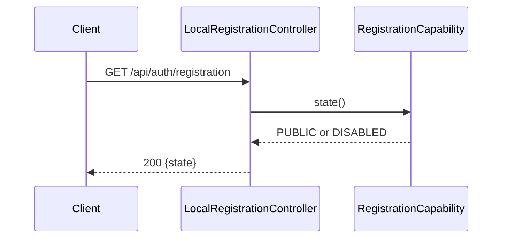

# User Registration Flow

- Document Status: `IMPLEMENTED`
- Feature / Slice: `M0-S4B2 / M0-S4C2 / M0-S4D`
- Last Verified: `2026-08-31`
- Entry: `GET /api/auth/registration`; `POST /api/auth/registration`

## 1. Behavior Boundary

本 Flow 描述 LOCAL_EMAIL public registration capability 查询与账号创建。`GET` 只返回启动时由
`REGISTRATION_ENABLED` 确定的 `PUBLIC` 或 `DISABLED`；`POST` 在 `PUBLIC` 状态下依次经过 CSRF、
Registration Rate Limit、email/password policy、Argon2id hashing 和原子 PostgreSQL persistence。

成功结果是 `204 No Content`，并在同一 transaction 中创建 `app_user`、`auth_identity` 与
`local_password_credential`。registration 不创建认证 Session，也不自动执行 login；用户之后必须走
`POST /api/auth/login` 才能建立 Redis-backed authentication state。

本 Flow 不包含 external Provider identity、Account Linking、password reset/change、profile onboarding 或
任何 `LanguageProfile` / Learning State 创建。`REGISTRATION_ENABLED=false` 时的 persistent singleton User
bootstrap 属于 deployment initialization，不是 public registration 请求的一部分。

## 2. Main Call Chain

### 2.1 Capability query



### 2.2 Public registration

```mermaid
sequenceDiagram
    autonumber
    participant Client
    participant CSRF as CsrfFilter
    participant Controller as LocalRegistrationController
    participant Capability as RegistrationCapability
    participant Limit as RedisAuthenticationAttemptRateLimiter
    participant Redis
    participant Service as LocalRegistrationService
    participant Email as LocalEmailNormalizer
    participant Policy as LocalPasswordPolicy
    participant Hasher as LocalPasswordHasher
    participant Persistence as LocalRegistrationPersistence
    participant UserRepo as UserRepository
    participant AuthRepo as LocalAuthenticationRepository
    participant PostgreSQL

    Client->>CSRF: POST /api/auth/registration + CSRF + email/password
    alt CSRF missing or mismatched
        CSRF-->>Client: 403; stop before Controller and Rate Limit
    else valid CSRF
        CSRF->>Controller: register(email, password, request)
        Controller->>Capability: state()
        alt state = DISABLED
            Controller-->>Client: 403 REGISTRATION_DISABLED
        else state = PUBLIC
            Controller->>Limit: recordRegistrationAttempt(client address, email)
            Limit->>Redis: atomically record hashed address/email buckets with TTL
            alt Rate Limit storage unavailable
                Controller-->>Client: 503 REGISTRATION_UNAVAILABLE
            else attempt rejected
                Controller-->>Client: 429 TOO_MANY_REGISTRATION_ATTEMPTS + Retry-After
            else attempt allowed
                Controller->>Service: register(email, password)
                Service->>Email: normalize(submitted email)
                Service->>Policy: validate(password, normalized email)
                Policy->>Policy: length + printable ASCII + identity + pinned blocklist checks
                alt email or password policy rejected
                    Service-->>Controller: typed LocalRegistrationException
                    Controller-->>Client: 400 specific policy code
                else policy accepted
                    Service->>Hasher: hash(raw password) under concurrency gate
                    Hasher-->>Service: versioned Argon2id verifier
                    Service->>Persistence: createLocalAccount(normalized email, verifier)
                    activate Persistence
                    Persistence->>UserRepo: create app_user
                    UserRepo->>PostgreSQL: INSERT app_user
                    Persistence->>AuthRepo: createLocalEmailIdentity(userId, email, verifier)
                    AuthRepo->>PostgreSQL: INSERT auth_identity + local_password_credential
                    alt unique identity conflict
                        PostgreSQL-->>Persistence: DuplicateKeyException
                        Persistence-->>PostgreSQL: rollback whole transaction
                        deactivate Persistence
                        Service-->>Controller: IDENTITY_UNAVAILABLE
                        Controller-->>Client: 409 IDENTITY_UNAVAILABLE
                    else persistence failure
                        PostgreSQL-->>Persistence: RuntimeException
                        Persistence-->>PostgreSQL: rollback whole transaction
                        deactivate Persistence
                        Service-->>Controller: REGISTRATION_FAILED
                        Controller-->>Client: 503 REGISTRATION_UNAVAILABLE
                    else all inserts succeed
                        PostgreSQL-->>Persistence: commit complete account
                        deactivate Persistence
                        Persistence-->>Service: userId
                        Service-->>Controller: userId (not exposed)
                        Controller-->>Client: 204; no SESSION cookie
                    end
                end
            end
        end
    end
```

## 3. State and Authority

- `RegistrationCapability` 在 application startup 时把 `REGISTRATION_ENABLED` 收敛成不可变的
  `PUBLIC` / `DISABLED` capability；POST 不允许客户端覆盖该状态。
- Redis Registration Rate Limit 使用与 login 分离的 key prefix 和 quota。client address / normalized
  email 只以 SHA-256 bucket key 出现；两个 bucket 都会计数，任一超限即拒绝。
- Java `LocalEmailNormalizer`、`LocalPasswordPolicy` 与 `LocalPasswordHasher` 负责 deterministic validation、
  pinned blocklist 和 versioned Argon2id verifier；这些规则不交给 LLM 或 Prompt。
- `LocalRegistrationPersistence.createLocalAccount` 的 Spring transaction 是三表写入的 atomic boundary；
  PostgreSQL `(provider, provider_subject)` unique constraint 是 concurrent duplicate 的最终裁决 authority。
- raw password 只存在于当前 request、policy 与 hashing 调用链；PostgreSQL 只保存
  `{argon2id-v1}$...` verifier，Redis、Session、response 和 safe log 都不保存 raw password。
- 注册成功只建立稳定内部 `userId` 和 LOCAL_EMAIL login identity；不建立 `UserContext`、Session、
  `LanguageProfile` 或 Persistent Learning State。

## 4. State Transition

```mermaid
stateDiagram-v2
    [*] --> CsrfChecked

    CsrfChecked --> RegistrationRejected: invalid CSRF
    CsrfChecked --> CapabilityChecked: valid CSRF
    CapabilityChecked --> RegistrationRejected: DISABLED
    CapabilityChecked --> PublicRequest: PUBLIC

    PublicRequest --> RegistrationRejected: rate limited / Rate Limit unavailable
    PublicRequest --> InputValidated: normalized email and password policy accepted
    PublicRequest --> RegistrationRejected: invalid email or password policy

    InputValidated --> PasswordHashed: Argon2id capacity acquired and hashing succeeds
    InputValidated --> RegistrationRejected: hash capacity or hashing failure

    PasswordHashed --> PersistenceTransaction: begin createLocalAccount
    PersistenceTransaction --> CompleteAccount: app_user + auth_identity + credential commit
    PersistenceTransaction --> RolledBack: duplicate identity or persistence failure

    CompleteAccount --> RegisteredUnauthenticated: 204; no Session created
    RolledBack --> RegistrationRejected: current request creates no partial account

    RegistrationRejected --> [*]
    RegisteredUnauthenticated --> [*]
```



`RegistrationRejected` 是 request outcome，不是账号 lifecycle state。并发 duplicate 场景中，database
可能已有另一个成功请求创建的完整账号，但失败请求自己的 transaction 必须整体 rollback，不留下孤立
`app_user`、identity 或 credential。

## 5. Failure / Rejection Paths

| Boundary | Result | State / work guarantee |
|---|---|---|
| CSRF cookie/header 缺失或不匹配 | `403` | Controller、Rate Limit、policy 和 Argon2 均不执行 |
| capability = `DISABLED` | `403 REGISTRATION_DISABLED` | 在 Redis Rate Limit、policy、Argon2 和 persistence 前停止 |
| Registration Rate Limit 超限 | `429 TOO_MANY_REGISTRATION_ATTEMPTS` | 返回 `Retry-After`；不进入 service / Argon2 |
| Rate Limit Redis unavailable | `503 REGISTRATION_UNAVAILABLE` | fail closed；不绕过 resource protection |
| invalid email/password policy | `400` + specific code | 不执行 persistence；低成本 policy 在 Argon2 前完成 |
| Argon2 capacity exhausted / hashing failure | `503 REGISTRATION_UNAVAILABLE` | 不开始 database transaction |
| normalized LOCAL_EMAIL 已存在 | `409 IDENTITY_UNAVAILABLE` | unique constraint 裁决；当前 transaction 整体 rollback |
| unexpected persistence failure | `503 REGISTRATION_UNAVAILABLE` | 当前 transaction 整体 rollback；response/log 不泄露底层 detail |
| success | `204` | 三表形成完整账号；不返回 userId，不创建 `SESSION` cookie |

## 6. Verification Evidence

- `LocalRegistrationHttpContractTests.reportsHostedRegistrationAsPublic`
- `LocalRegistrationHttpContractTests.reportsSelfHostedRegistrationAsDisabled`
- `LocalRegistrationHttpContractTests.disabledRegistrationStopsBeforeRateLimitAndRegistration`
- `LocalRegistrationHttpContractTests.missingCsrfStopsBeforeRateLimitAndRegistration`
- `LocalRegistrationHttpContractTests.rateLimitedRegistrationReturnsRetryAfterWithoutCallingRegistrationService`
- `LocalRegistrationHttpContractTests.successfulRegistrationReturnsNoContentAndDoesNotCreateSession`
- `LocalRegistrationPersistenceIntegrationTests.createsUserIdentityAndCredentialAtomically`
- `LocalRegistrationPersistenceIntegrationTests.concurrentDuplicateRegistrationCreatesExactlyOneCompleteAccount`
- `RedisAuthenticationAttemptRateLimiterIntegrationTests.concurrentAttemptsAtomicallyEnforceTheRegistrationEmailLimitAndExpireTheirBuckets`
- `LocalRegistrationLoginIntegrationTests.hostedRegistrationThenLoginCreatesRedisSessionAndRestoresCurrentUser`
- Targeted authentication / registration verification on 2026-08-31: `43/43` executed tests PASS;
  `11` PostgreSQL / Redis environment-gated tests skipped.

## 7. Source References

- `server/src/main/java/com/dailylanguage/authentication/api/LocalRegistrationController.java`
- `server/src/main/java/com/dailylanguage/authentication/application/RegistrationCapability.java`
- `server/src/main/java/com/dailylanguage/authentication/application/LocalRegistrationService.java`
- `server/src/main/java/com/dailylanguage/authentication/domain/LocalEmailNormalizer.java`
- `server/src/main/java/com/dailylanguage/authentication/domain/LocalPasswordPolicy.java`
- `server/src/main/java/com/dailylanguage/authentication/domain/LocalPasswordBlocklist.java`
- `server/src/main/java/com/dailylanguage/authentication/infrastructure/LocalPasswordHasher.java`
- `server/src/main/java/com/dailylanguage/authentication/infrastructure/LocalRegistrationPersistence.java`
- `server/src/main/java/com/dailylanguage/authentication/infrastructure/LocalAuthenticationRepository.java`
- `server/src/main/java/com/dailylanguage/security/infrastructure/RedisAuthenticationAttemptRateLimiter.java`
- `server/src/main/resources/mapper/LocalAuthenticationMapper.xml`
- `server/src/main/resources/db/migration/V1__initialize_persistence_identity.sql`
- `server/src/main/resources/db/migration/V2__add_local_authentication_identity.sql`
